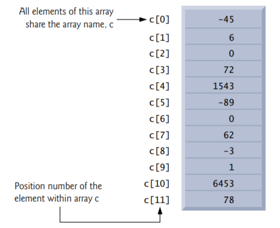

# C Arrays

## Objectives

Use the array data structure to represent lists and tables of values. 

Define an array, initialize an array and refer to individual elements of an array. 

Define symbolic constants.

Pass arrays to functions. 

Use arrays to store, sort and search lists and tables of values. 

Define and manipulate multidimensional arrays. 

Create variable-length arrays whose size is determined at execution time. 

Understand security issues related to input with scanf, output with printf and arrays.

## Introduction

This chapter introduces data structures. Arrays are data structures consisting of related data items of the same type. Arrays and structs are “static” entities in that they remain the same size throughout program execution (they may, of course, be of automatic storage class and hence created and destroyed each time the blocks in which they’re defined are entered and exited). 

## Arrays

An array is a group of contiguous memory locations that all have the same type. To refer to a particular location or element in the array, we specify the array’s name and the position number of the particular element in the array. 



It shows an integer array called c, containing 12 elements. Any one of these elements may be referred to by giving the array’s name followed by the position number of the particular element in square brackets ([]). The first element in every array is the zeroth element (i.e., the one with position number 0). An array name, like other identifiers, can contain only letters, digits and underscores and cannot begin with a digit.

The position number in square brackets is called the element’s index or subscript. An index must be an integer or an integer expression. For example, the statement

```c
c[2] = 1000;
```

assigns 1000 to array element c[2]. Similarly, if a = 5 and b = 6, then the statement

```c
c[a + b] += 2;
```

adds 2 to array element c[11]. An indexed array name is an lvalue—it can be used on the left side of an assignment.

Let’s examine array c more closely. The array’s name is c. Its 12 elements are referred to as c[0], c[1], c[2], …, c[10] and c[11]. The value stored in c[0] is –45, the value of c[1] is 6, c[2] is 0, c[7] is 62 and c[11] is 78. To print the sum of the values contained in the first three elements of array c, we’d write

```c
printf("%d", c[0] + c[1] + c[2]);
```

To divide the value of element 6 of array c by 2 and assign the result to the variable x, write

```c
x = c[6] / 2;
```

The brackets used to enclose an array’s index are actually considered to be an operator in C. They have the same level of precedence as the function call operator (i.e., the parentheses that are placed after a function name to call that function).

## Defining Arrays

Arrays occupy space in memory. You specify the type of each element and the number of elements each array requires so that the computer may reserve the appropriate amount of memory. The following definition reserves 12 elements for integer array c, which has indices in the range 0–11.

```c
int c[12];
```

The definition 

```c
int b[100], x[27];
```

reserves 100 elements for integer array b and 27 elements for integer array x. These arrays have indices in the ranges 0–99 and 0–26, respectively. Though you can define multiple arrays at once, defining only one per line is preferred, so you can add a comment explaining each array’s purpose.

Arrays may contain other data types. For example, an array of type char can store a character string.

## Array Examples

###  Defining an Array and Using a Loop to Set the Array’s Element Values

###  Initializing an Array in a Definition with an Initializer List

### Specifying an Array’s Size with a Symbolic Constant and Initializing Array Elements with Calculations

### Summing the Elements of an Array

### Using Arrays to Summarize Survey Results

###  Graphing Array Element Values with Histograms

###  Rolling a Die 60,000,000 Times and Summarizing the Results in an Array

##  Using Character Arrays to Store and Manipulate Strings

We’ve discussed only integer arrays. However, arrays are capable of holding data of any type. We now discuss storing strings in character arrays. So far, the only string-processing capability we have is outputting a string with printf. A string such as "hello" is really an array of individual characters in C.

###  Initializing a Character Array with a String

Character arrays have several unique features. A character array can be initialized using a string literal. For example, 

```c
char string1[] = "first";
```

initializes the elements of array string1 to the individual characters in the string literal "first". In this case, the size of array string1 is determined by the compiler based on the length of the string. The string "first" contains five characters plus a special string-termination character called the null character. Thus, array string1 actually contains six elements. The escape sequence representing the null character is '\0'. All strings in C end with this character. A character array representing a string should always be defined large enough to hold the number of characters in the string and the terminating null character.

###  Initializing a Character Array with an Intializer List of Characters

Character arrays also can be initialized with individual character constants in an initializer list, but this can be tedious. The preceding definition is equivalent to

```c
char string1[] = {'f', 'i', 'r', 's', 't', '\0'};
```

###  Accessing the Characters in a String

Because a string is really an array of characters, we can access individual characters in a string directly using array index notation. For example, string1[0] is the character 'f' and string1[3] is the character 's'.

###  Inputting into a Character Array

We also can input a string directly into a character array from the keyboard using scanf and the conversion specifier %s. For example, 

```c
char string2[20];
```

creates a character array capable of storing a string of at most 19 characters and a terminating null character. The statement

```c
scanf("%19s", string2);
```

reads a string from the keyboard into string2. The name of the array is passed to scanf without the preceding & used with nonstring variables. The & is normally used to provide scanf with a variable’s location in memory so that a value can be stored there. When we discuss passing arrays to functions, we’ll see that the value of an array name is the address of the start of the array; therefore, the & is not necessary. Function scanf will read characters until a space, tab, newline or end-of-file indicator is encountered. The string string2 should be no longer than 19 characters to leave room for the terminating null character. If the user types 20 or more characters, your program may crash or create a security vulnerability called buffer overflow. For this reason, we used the conversion specifier %19s so that scanf reads a maximum of 19 characters and does not write characters into memory beyond the end of the array string2.

It’s your responsibility to ensure that the array into which the string is read is capable of holding any string that the user types at the keyboard. Function scanf does not check how large the array is. Thus, scanf can write beyond the end of the array. 

### Outputting a Character Array That Represents a String

A character array representing a string can be output with printf and the %s conversion specifier. The array string2 is printed with the statement

```c
printf("%s\n", string2);
```

Function printf, like scanf, does not check how large the character array is. The characters of the string are printed until a terminating null character is encountered. [Consider what would print if, for some reason, the terminating null character were missing.]

### Demonstrating Character Arrays

## Static Local Arrays and Automatic Local Arrays

 A static local variable exists for the duration of the program but is visible only in the function body. We can apply static to a local array definition so the array is not created and initialized each time the function is called and the array is not destroyed each time the function is exited in the program. This reduces program execution time, particularly for programs with frequently called functions that contain large arrays.

Arrays that are static are initialized once at program startup. If you do not explicitly initialize a static array, that array’s elements are initialized to zero by default. 

##  Passing Arrays to Functions

To pass an array argument to a function, specify the array’s name without any brackets. For example, if array hourlyTemperatures has been defined as

```c
int hourlyTemperatures[HOURS_IN_A_DAY];
```

the function call 

```c
modifyArray(hourlyTemperatures, HOURS_IN_A_DAY)
```

passes array hourlyTemperatures and its size to function modifyArray. 

Recall that all arguments in C are passed by value. C automatically passes arrays to functions by reference — the called functions can modify the element values in the callers’ original arrays. The array’s name evaluates to the address of the array’s first element. Because the starting address of the array is passed, the called function knows precisely where the array is stored. Therefore, when the called function modifies array elements in its function body, it’s modifying the actual elements of the array in their original memory locations. 

Although entire arrays are passed by reference, individual array elements are passed by value exactly as simple variables are. Such simple single pieces of data (such as individual ints, floats and chars) are called scalars. To pass an element of an array to a function, use the indexed name of the array element as an argument in the function call. 

For a function to receive an array through a function call, the function’s parameter list must specify that an array will be received. For example, the function header for function modifyArray (that we called earlier in this section) might be written as

```c
void modifyArray(int b[], size_t size)
```

indicating that modifyArray expects to receive an array of integers in parameter b and the number of array elements in parameter size. The size of the array is not required between the array brackets. If it’s included, the compiler checks that it’s greater than zero, then ignores it. Specifying a negative size is a compilation error. Because arrays are automatically passed by reference, when the called function uses the array name b, it will be referring to the array in the caller (array hourlyTemperatures in the preceding call).

### Difference Between Passing an Entire Array and Passing an Array Element

### Using the const Qualifier with Array Parameters

## Sorting Arrays

Sorting data (i.e., placing the data into ascending or descending order) is one of the most important computing applications. A bank sorts all checks by account number so that it can prepare individual bank statements at the end of each month. Telephone companies sort their lists of accounts by last name and, within that, by first name to make it easy to find phone numbers. Virtually every organization must sort some data, and in many cases massive amounts of it. Sorting data is an intriguing problem which has attracted some of the most intense research efforts in the field of computer science.

## Case Study: Computing Mean, Median and Mode Using Arrays

## Searching Arrays

You’ll often work with large amounts of data stored in arrays. It may be necessary to determine whether an array contains a value that matches a certain key value. The process of finding a particular element of an array is called searching. In this section we discuss two searching techniques—the simple linear search technique and the more efficient (but more complex) binary search technique. 

###  Searching an Array with Linear Search

###  Searching an Array with Binary Search

##  Multidimensional Arrays

Arrays in C can have multiple indices. A common use of multidimensional arrays, which the C standard refers to as multidimensional arrays, is to represent tables of values consisting of information arranged in rows and columns. To identify a particular table element, we must specify two indices: The first (by convention) identifies the element’s row and the second (by convention) identifies the element’s column. Tables or arrays that require two indices to identify a particular element are called two-dimensional arrays. Multidimensional arrays can have more than two indices. 

###  Illustrating a Double-Subcripted Array

### Initializing a Double-Subcripted Array

###  Setting the Elements in One Row

###  Totaling the Elements in a Two-Dimensional Array

### Two-Dimensonal Array Manipulations

##  Variable-Length Arrays

For each array you’ve defined so far, you’ve specified its size at compilation time. But what if you cannot determine an array’s size until execution time? In the past, to handle this, you had to use dynamic memory allocation. For cases in which an array’s size is not known at compilation time, C has variable-length arrays (VLAs)—that is, arrays whose lengths are defined in terms of expressions evaluated at execution time. 

## Secure C Programming

### Bounds Checking for Array Indices 

### scanf_s

### Don’t Use Strings Read from the User as Format-Control Strings

