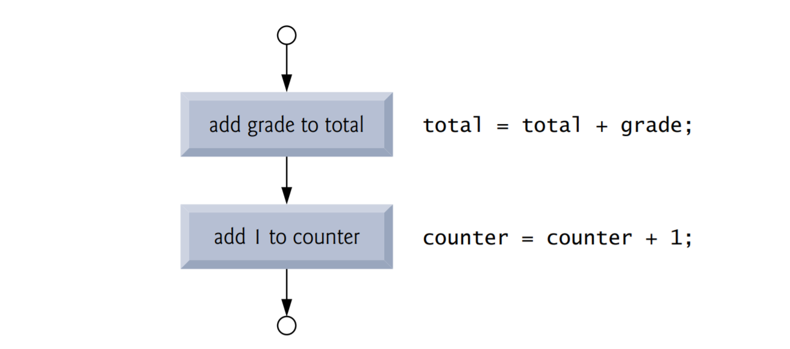
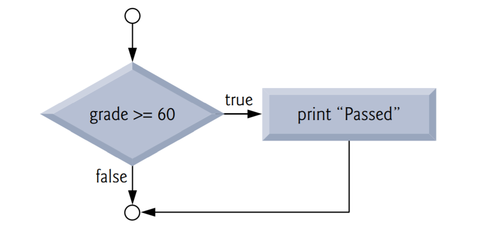
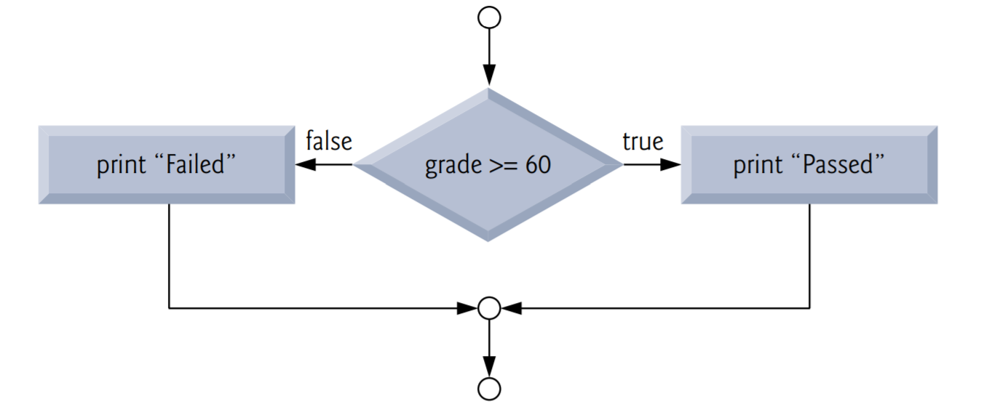
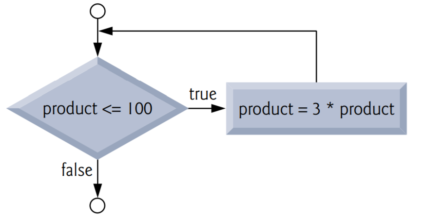

# Structured Program Development in C

## Objectives

Use basic problem-solving techniques.

Develop algorithms through the process of top-down, stepwise refinement. 

Use the if selection statement and the if…else selection statement to select actions. 

Use the while iteration statement to execute statements in a program repeatedly. 

Use counter-controlled iteration and sentinelcontrolled iteration. 

Learn structured programming. 

Use increment, decrement and assignment operators.

## Introduction

Before writing a program to solve a particular problem, we must have a thorough understanding of the problem and a carefully planned solution approach.

## Algorithms

The solution to any computing problem involves executing a series of actions in a specific order. A procedure for solving a problem in terms of

1. the actions to be executed, and
2. the order in which these actions are to be executed

is called an algorithm. The following example demonstrates that correctly specifying the order in which the actions are to be executed is important.

Consider the “rise-and-shine algorithm” followed by one junior executive for getting out of bed and going to work: (1) Get out of bed, (2) take off pajamas, (3) take a shower, (4) get dressed, (5) eat breakfast, (6) carpool to work. This routine gets the executive to work well prepared to make critical decisions. Suppose that the same steps are performed in a slightly different order: (1) Get out of bed, (2) take off pajamas, (3) get dressed, (4) take a shower, (5) eat breakfast, (6) carpool to work. In this case, our junior executive shows up for work soaking wet. Specifying the order in which statements are to be executed in a computer program is called program control. In this and the next chapter, we investigate C’s program control capabilities.

## Pseudocode

Pseudocode is an artificial and informal language that helps you develop algorithms. The pseudocode we present here is particularly useful for developing algorithms that will be converted to structured C programs. Pseudocode is similar to everyday English; it’s convenient and user friendly although it’s not an actual computer programming language.

Pseudocode programs are not executed on computers. Rather, they merely help you “think out” a program before attempting to write it in a programming language like C. 

Pseudocode consists purely of characters, so you may conveniently type pseudocode programs into a computer using a text editor program. A carefully prepared pseudocode program can be easily converted to a corresponding C program. This is done in many cases simply by replacing pseudocode statements with their C equivalents.

Pseudocode consists only of action and decision statements—those that are executed when the program has been converted from pseudocode to C and is run in C. Definitions are not executable statements—they’re simply messages to the compiler. 

## Control Structures

Normally, statements in a program are executed one after the other in the order in which they’re written. This is called sequential execution. Various C statements we’ll soon discuss enable you to specify that the next statement to be executed may be other than the next one in sequence. This is called transfer of control.

### Flowcharts

A flowchart is a graphical representation of an algorithm or of a portion of an algorithm. Flowcharts are drawn using certain special-purpose symbols such as rectangles, diamonds, rounded rectangles, and small circles; these symbols are connected by arrows called flowlines. 

Like pseudocode, flowcharts are useful for developing and representing algorithms, although pseudocode is preferred by most programmers. Flowcharts clearly show how control structures operate; that’s what we use them for in this text. 



When drawing a flowchart that represents a complete algorithm, the first symbol we use is a rounded rectangle symbol containing the word “Begin.” The last symbol is a rounded rectangle containing the word “End.” When drawing only a portion of an algorithm, we omit the rounded rectangle symbols in favor of using small circle symbols, also called connector symbols. 

Perhaps the most important flowcharting symbol is the diamond symbol, also called the decision symbol, which indicates that a decision is to be made. We’ll discuss the diamond symbol in the next section.

### Selection Statements in C

C provides three types of selection structures in the form of statements. The if selection statement either selects (performs) an action if a condition is true or skips the action if the condition is false. The if…else selection statement  performs an action if a condition is true and performs a different action if the condition is false. The switch selection statement performs one of many different actions, depending on the value of an expression. The if statement is called a single-selection statement because it selects or ignores a single action. The if…else statement is called a double-selection statement because it selects between two different actions. The switch statement is called a multiple-selection statement because it selects among many different actions. 

### Iteration Statements in C

C provides three types of iteration structures in the form of statements, namely while, do…while, and for.

That’s all there is. C has only seven control statements: sequence, three types of selection and three types of iteration. Each C program is formed by combining as many of each type of control statement as is appropriate for the algorithm the program implements. We can attach the control-statement flowchart segments to one another by connecting the exit point of one control statement to the entry point of the next. This is much like the way in which a child stacks building blocks, so we call this control-statement stacking. We’ll learn that there’s only one other way control statements may be connected—a method called control-statement nesting. Thus, any C program we’ll ever need to build can be constructed from only seven different types of control statements combined in only two ways. This is the essence of simplicity.

## The if Selection Statement

Selection statements are used to choose among alternative courses of action. For example, suppose the passing grade on an exam is 60. The pseudocode statement

```
If student’s grade is greater than or equal to 60
	Print “Passed”
```

determines whether the condition “student’s grade is greater than or equal to 60” is true or false. If the condition is true, then “Passed” is printed, and the next pseudocode statement in order is “performed” (remember that pseudocode isn’t a real programming language). If the condition is false, the printing is ignored, and the next pseudocode statement in order is performed. 

The preceding pseudocode If statement may be written in C as

```c
if (grade >= 60) {
    puts("Passed");
} // end if
```

Notice that the C code corresponds closely to the pseudocode (of course you’ll also need to declare the int variable grade). This is one of the properties of pseudocode that makes it such a useful program-development tool. The second line of this selection statement is indented. Such indentation is optional, but it’s highly recommended, as it helps emphasize the inherent structure of structured programs. The C compiler ignores white-space characters such as blanks, tabs and newlines used for indentation and vertical spacing.

The flowchart illustrates the single-selection if statement. This flowchart contains what is perhaps the most important flowcharting symbol—the diamond symbol, also called the decision symbol, which indicates that a decision is to be made. The decision symbol contains an expression, such as a condition, that can be either true or false. The decision symbol has two flowlines emerging from it. One indicates the direction to take when the expression in the symbol is true and the other the direction to take when the expression is false. Decisions can be based on conditions containing relational or equality operators. In fact, a decision can be based on any expression—if the expression evaluates to zero, it’s treated as false, and if it evaluates to nonzero, it’s treated as true.



The if statement, too, is a single-entry/single-exit statement. We’ll soon learn that the flowcharts for the remaining control structures can also contain (besides small circle symbols and flowlines) only rectangle symbols to indicate the actions to be performed, and diamond symbols to indicate decisions to be made. This is the action/decision model of programming we’ve been emphasizing. 

We can envision seven bins, each containing only control-statement flowcharts of one of the seven types. These flowchart segments are empty—nothing is written in the rectangles and nothing in the diamonds. Your task, then, is assembling a program from as many of each type of control statement as the algorithm demands, combining them in only two possible ways (stacking or nesting), and then filling in the actions and decisions in a manner appropriate for the algorithm. We’ll discuss the variety of ways in which actions and decisions may be written. 

## The if...else Selection Statement

The if selection statement performs an indicated action only when the condition is true; otherwise the action is skipped. The if…else selection statement allows you to specify that different actions are to be performed when the condition is true and when it’s false. For example, the pseudocode statement

```
If student’s grade is greater than or equal to 60
	Print “Passed”
else
	Print “Failed”
```

prints Passed if the student’s grade is greater than or equal to 60 and Failed if the student’s grade is less than 60. In either case, after printing occurs, the next pseudocode statement in sequence is “performed.” The body of the else is also indented. 

The preceding pseudocode If…else statement may be written in C as

```c
if ( grade >= 60 ) {
	puts( "Passed" );
} // end if
else {
	puts( "Failed" );
} // end else
```

The flowchart  illustrates the flow of control in the if…else statement. Once again, besides small circles and arrows, the only symbols in the flowchart are rectangles (for actions) and a diamond (for a decision). 



C provides the conditional operator (?:), which is closely related to the if…else statement. The conditional operator is C’s only ternary operator—it takes three operands. These together with the conditional operator form a conditional expression. The first operand is a condition. The second operand is the value for the entire conditional expression if the condition is true and the third operand is the value for the entire conditional expression if the condition is false. For example, the puts statement

```c
puts( grade >= 60 ? "Passed" : "Failed" );
```

contains as its argument a conditional expression that evaluates to the string "Passed" if the condition grade >= 60 is true and to the string "Failed" if the condition is false. The puts statement performs in essentially the same way as the preceding if…else statement.

The second and third operands in a conditional expression can also be actions to be executed. For example, the conditional expression

```c
grade >= 60 ? puts( "Passed" ) : puts( "Failed" );
```

is read, “If grade is greater than or equal to 60, then puts("Passed"), otherwise puts("Failed").” This, too, is comparable to the preceding if…else statement. Conditional operators can be used in places where if…else statements cannot, including expressions and arguments to functions (like printf). 

### Nested if...else Statements

Nested if…else statements test for multiple cases by placing if…else statements inside if…else statements. For example, the following pseudocode statement will print A for exam grades greater than or equal to 90, B for grades greater than or equal to 80 (but less than 90), C for grades greater than or equal to 70 (but less than 80), D for grades greater than or equal to 60 (but less than 70), and F for all other grades.

```
If student’s grade is greater than or equal to 90
	Print “A”
else
    If student’s grade is greater than or equal to 80
    	Print “B”
    else
        If student’s grade is greater than or equal to 70
        	Print “C”
        else
            If student’s grade is greater than or equal to 60
            	Print “D”
            else
            	Print “F”
```

This pseudocode may be written in C as 

```c
if ( grade >= 90 ) {
	puts( "A" );
} // end if
else {
    if ( grade >= 80 ) {
    	puts( "B" );
    } // end if
    else {
        if ( grade >= 70 ) {
        	puts( "C" );
        } // end if
        else {
            if ( grade >= 60 ) {
            	puts( "D" );
            } // end if
            else {
            	puts( "F" );
            } // end else
        } // end else
    } // end else
} // end else
```

If the variable grade is greater than or equal to 90, all four conditions will be true, but only the puts statement after the first test will be executed. After that puts is executed, the else part of the “outer” if…else statement is skipped. You may prefer to write the preceding if statement as 

```c
if ( grade >= 90 ) {
	puts( "A" );
} // end if
else if ( grade >= 80 ) {
	puts( "B" );
} // end else if
else if ( grade >= 70 ) {
	puts( "C" );
} // end else if
else if ( grade >= 60 ) {
	puts( "D" );
} // end else if
else {
	puts( "F" );
} // end else 
```

As far as the C compiler is concerned, both forms are equivalent. The latter form is popular because it avoids the deep indentation of the code to the right. Such indentation often leaves little room on a line, forcing lines to be split and decreasing program readability.

The if selection statement expects only one statement in its body—if you have only one statement in the if’s body, you do not need to enclose it in braces. To include several statements in the body of an if, you must enclose the set of statements in braces ({ and }). A set of statements contained within a pair of braces is called a compound statement or a block. 

The following example includes a compound statement in the else part of an if…else statement.

```c
if ( grade >= 60 ) {
	puts( "Passed." );
} // end if
else {
	puts( "Failed." );
	puts( "You must take this course again." );
} // end else
```

In this case, if grade is less than 60, the program executes both puts statements in the body of the else and prints

```
Failed.
You must take this course again.
```

The braces surrounding the two statements in the else clause are important. Without them, the statement

```c
puts( "You must take this course again." );
```

would be outside the body of the else part of the if and would execute regardless of whether the grade was less than 60, so even a passing student would have to take the course again!

A syntax error is caught by the compiler. A logic error has its effect at execution time. A fatal logic error causes a program to fail and terminate prematurely. A nonfatal logic error allows a program to continue executing but to produce incorrect results. 

Just as a compound statement can be placed anywhere a single statement can be placed, it’s also possible to have no statement at all, i.e., the empty statement. The empty statement is represented by placing a semicolon (;) where a statement would normally be.

### The while Iteration Statement

An iteration statement (also called an repetition statement or loop) allows you to specify that an action is to be repeated while some condition remains true. The pseudocode statement

```
While there are more items on my shopping list
	Purchase next item and cross it off my list
```

describes the iteration that occurs during a shopping trip. The condition, “there are more items on my shopping list” may be true or false. If it’s true, then the action, “Purchase next item and cross it off my list” is performed. This action will be performed repeatedly while the condition remains true. The statement(s) contained in the while iteration statement constitute the body of the while. The while statement body may be a single statement or a compound statement. 

Eventually, the condition will become false (when the last item on the shopping list has been purchased and crossed off the list). At this point, the iteration terminates, and the first pseudocode statement after the iteration structure is executed.

As an example of a while statement, consider a program segment designed to find the first power of 3 larger than 100. The integer variable product has been initialized to 3. When the following code finishes executing, product will contain the desired answer:

```c
product = 3;
while ( product <= 100 ) {
	product = 3 * product;
}
```

The flowchart illustrates the flow of control in the preceding while iteration statement. Once again, note that (besides small circles and arrows) the flowchart contains only a rectangle symbol and a diamond symbol. The flowchart clearly shows the iteration. The flowline emerging from the rectangle wraps back to the decision, which is tested each time through the loop until the decision eventually becomes false. At this point, the while statement is exited and control passes to the next statement in the program.



When the while statement is entered, the value of product is 3. The variable product is repeatedly multiplied by 3, taking on the values 9, 27 and 81 successively. When product becomes 243, the condition in the while statement, product <= 100, becomes false. This terminates the iteration, and the final value of product is 243. Program execution continues with the next statement after the while.

## Formulating Algorithms Case Study 1: CounterControlled Iteration


## Formulating Algorithms with Top-Down, Stepwise Refinement Case Study 2: Sentinel-Controlled Iteration

### Converting Between Types Explicitly and Implicitly

```c
average = ( float ) total / counter; 
```

includes the cast operator (float), which creates a temporary floating-point copy of its operand, total. The value stored in total is still an integer. Using a cast operator in this manner is called explicit conversion. The calculation now consists of a floating-point value (the temporary float version of total) divided by the unsigned int value stored in counter. C evaluates arithmetic expressions only in which the data types of the operands are identical. To ensure that the operands are of the same type, the compiler performs an operation called implicit conversion on selected operands.

Cast operators are available for most data types—they’re formed by placing parentheses around a type name. Each cast operator is a unary operator, i.e., an operator that takes only one operand. C also supports unary versions of the plus (+) and minus (-) operators, so you can write expressions such as -7 or +5. Cast operators associate from right to left and have the same precedence as other unary operators such as unary + and unary -. This precedence is one level higher than that of the multiplicative operators *, / and %.

### Formatting Floating-Point Numbers

The .2 is the precision with which the value will be displayed—with 2 digits to the right of the decimal point. If the %f conversion specifier is used (without specifying the precision), the default precision of 6 is used—exactly as if the conversion specifier %.6f had been used. When floating-point values are printed with precision, the printed value is rounded to the indicated number of decimal positions. The value in memory is unaltered. When the following statements are executed, the values 3.45 and 3.4 are printed. 

```c
printf( "%.2f\n", 3.446 ); // prints 3.45
printf( "%.1f\n", 3.446 ); // prints 3.4
```

### Notes on Floating-Point Numbers

Although floating-point numbers are not always “100% precise,” they have numerous applications. For example, when we speak of a “normal” body temperature of 98.6 Fahrenheit, we do not need to be precise to a large number of digits. When we view the temperature on a thermometer and read it as 98.6, it may actually be 98.5999473210643. The point here is that calling this number simply 98.6 is fine for most applications. We’ll say more about this issue later.

Another way floating-point numbers develop is through division. When we divide 10 by 3, the result is 3.3333333… with the sequence of 3s repeating infinitely. The computer allocates only a fixed amount of space to hold such a value, so the stored floating-point value can be only an approximation.

## Formulating Algorithms with Top-Down, Stepwise Refinement Case Study 3: Nested Control Statements


## Assignment Operators

C provides several assignment operators for abbreviating assignment expressions. For example, the statement

```c
c = c + 3;
```

can be abbreviated with the addition assignment operator += as

```c
c += 3;
```

The += operator adds the value of the expression on the right of the operator to the value of the variable on the left of the operator and stores the result in the variable on the left of the operator. Any statement of the form

```
variable = variable operator expression;
```

where operator is one of the binary operators +, -, *, / or %, can be written in the form

```
variable operator= expression;
```

## Increment and Decrement Operators

C also provides the unary increment operator, ++, and the unary decrement operator, --. If a variable c is to be incremented by 1, the increment operator ++ can be used rather than the expressions c = c + 1 or c += 1. If increment or decrement operators are placed before a variable (i.e., prefixed), they’re referred to as the preincrement or predecrement operators, respectively. If increment or decrement operators are placed after a variable (i.e., postfixed), they’re referred to as the postincrement or postdecrement operators, respectively. Preincrementing (predecrementing) a variable causes the variable to be incremented (decremented) by 1, then its new value is used in the expression in which it appears. Postincrementing (postdecrementing) the variable causes the current value of the variable to be used in the expression in which it appears, then the variable value is incremented (decremented) by 1. 

| Operator | Sample expression | Explanation                                                  |
| -------- | ----------------- | ------------------------------------------------------------ |
| ++       | ++a               | Increment a by 1, then use the new value of a in the expression in which a resides. |
| ++       | a++               | Use the current value of a in the expression in which a resides, then increment a by 1. |
| --       | --b               | Decrement b by 1, then use the new value of b in the expression in which b resides. |
| --       | b--               | Use the current value of b in the expression in which b resides, then decrement b by 1. |

## Secure C Programming

### Arithmetic Overflow 

### Unsigned Integers 

### scanf_s and printf_s

