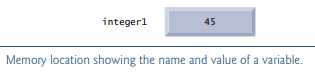
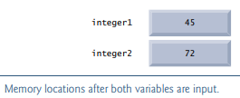
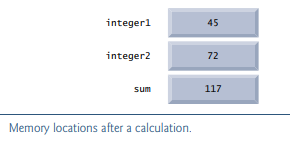

# Introduction to C Programming

## Textbook TIPS

- Pay attention
- Digest and follow

## Objectives

Write simple C programs. 

Use simple input and output statements. 

Use the fundamental data types.

Learn computer memory concepts. 

Use arithmetic operators. 

Learn the precedence of arithmetic operators. 

Write simple decision-making statements. 

Begin focusing on secure C programming practices.

## Introduction

The C language facilitates a structured and disciplined approach to computer-program design. In this chapter we introduce C programming and present several examples that illustrate many important features of C. Each example is analyzed one statement at a time.

We provide the first of many “Secure C Programming” sections.

## A Simple C Program: Printing a Line of Text

```c
// A first program in C.
#include <stdio.h>

// function main begins program execution 
int main(void) {
    printf("Welcome to C!\n");
    return 0;
} // end function main
```

### Comments

```c
// A first program in C.
```

begin with //, indicating that these two lines are comments. You insert comments to document programs and improve program readability. Comments do not cause the computer to perform any action when the program is run—they’re ***ignored*** by the C compiler and do ***not*** cause any machine-language object code to be generated. 

You can also use /\*…\*/ multi-line comments in which everything from /* on the first line to \*/ at the end of the last line is a comment. We prefer // comments because they’re shorter and they eliminate common programming errors that occur with /\*…\*/ comments, especially when the closing */ is omitted.

### #include Preprocess Directive

```c
#include <stdio.h>
```

is a directive to the C preprocessor. Lines beginning with # are processed by the preprocessor before compilation. It tells the preprocessor to include the contents of the standard input/output header (<stdio.h>) in the program. This header contains information used by the compiler when compiling calls to standard input/output library functions such as printf. 

### Blank Lines and White Space

You use blank lines, space characters and tab characters (i.e., “tabs”) to make programs easier to read. Together, these characters are known as white space. White-space characters are normally ignored by the compiler. 

### The main Function

```c
int main(void)
```

is a part of every C program. The parentheses after main indicate that main is a program building block called a function. C programs contain one or more functions, one of which must be main. Every program in C begins executing at the function main. Functions can return information. The keyword int to the left of main indicates that main “returns” an integer (whole-number) value.

Functions also can receive information when they’re called upon to execute. The void in parentheses here means that main does not receive any information.

### An Output Statement

```c
printf( "Welcome to C!\n" );
```

instructs the computer to perform an action, namely to print on the screen the string of characters marked by the quotation marks. A string is sometimes called a character string, a message or a literal. The entire line, including the printf function (the “f” stands for “formatted”), its argument within the parentheses and the semicolon (;), is called a statement. Every statement must end with a semicolon (also known as the statement terminator). When the preceding printf statement is executed, it prints the message Welcome to C! on the screen. The characters normally print exactly as they appear between the double quotes in the printf statement. 

### Escape Sequences

Notice that the characters \n were not printed on the screen. The backslash (\) as used here is called an escape character. It indicates that printf is supposed to do something out of the ordinary. When encountering a backslash in a string, the compiler looks ahead at the next character and combines it with the backslash to form an escape sequence. The escape sequence \n means newline. When a newline appears in the string output by a printf, the newline causes the cursor to position to the beginning of the next line on the screen.

| Escape sequence | Description                                                  |
| --------------- | ------------------------------------------------------------ |
| \n              | Newline. Position the cursor at the beginning of the next line |
| \t              | Horizontal tab. Move the cursor to the next tab stop         |
| \a              | Alert. Produces a sound or visible alert without changing the current cursor position |
| \\\             | Backslash. Insert a backslash character in a string          |
| \\"             | Double quote. Insert a double-quote character in a string    |

Because the backslash has special meaning in a string, i.e., the compiler recognizes it as an escape character, we use a double backslash (\\) to place a single backslash in a string. Printing a double quote also presents a problem because double quotes mark the boundaries of a string—such quotes are not printed. By using the escape sequence \" in a string to be output by printf, we indicate that printf should display a double quote. The right brace, }, indicates that the end of main has been reached. 

We said that printf causes the computer to perform an action. As any program executes, it performs a variety of actions and makes decisions. 

### Return Value

Return a value to the caller.

Normally, returning 0 means ok, 1 means error.

### The Linker and Executables

Standard library functions like printf and scanf are not part of the C programming language. For example, the compiler cannot find a spelling error in printf or scanf. When the compiler compiles a printf statement, it merely provides space in the object program for a “call” to the library function. But the compiler does not know where the library functions are—the linker does. When the linker runs, it locates the library functions and inserts the proper calls to these library functions in the object program. Now the object program is complete and ready to be executed. For this reason, the linked program is called an executable. If the function name is misspelled, the linker will spot the error, because it will not be able to match the name in the C program with the name of any known function in the libraries.

### Using Multiple printfs

```c
#include <stdio.h>

int main(void) {
    printf("Welcome ");
    printf("to C!\n");
    return 0;
}
```

 This works because each printf resumes printing where the previous printf stopped printing. The first printf prints Welcome followed by a space (but no newline), and the second printf  begins printing on the same line immediately following the space. 

```c
#include <stdio.h>

int main(void) {
    printf("Welcome\nto\nC!\n");
    return 0;
}
```

One printf can print several lines by using additional newline characters. Each time the \n (newline) escape sequence is encountered, output continues at the beginning of the next line. 

## Another Simple C Program: Adding Two Integers

```c
// Addition program.
#include <stdio.h>

int main(void)
{
    int integer1; // first number to be entered by user
    int integer2; // second number to be entered by user

    printf("Enter first integer\n"); // prompt
    scanf("%d", &integer1);          // read an integer

    printf("Enter second integer\n"); // prompt
    scanf("%d", &integer2);           // read an integer

    int sum;                   // variable in which sum will be stored
    sum = integer1 + integer2; // assign total to sum

    printf("Sum is %d\n", sum); // print sum

    return 0;
} // end function main
```


### Variables and Variable Definitions


### Define Variables Before They Are Used


### Defining Multiple Variables of the Same Type in One Statement


### Identifiers and Case Sensitivity


### Prompting Messages


### The scanf Function and Formatted Inputs


### Prompting for and Inputting the Second Integer


### Defining the sum Variable


### Assignment Statement


### Printing with a Format Control String


### Combining a Variable Definition and Assignment Statement


### Calculations in printf Statements


## Memory Concepts

Variable names such as integer1, integer2 and sum actually correspond to locations in the computer’s memory. Every variable has a name, a type and a value. When

```c
scanf("%d", &integer1);
```

is executed, the value entered by the user is placed into a memory location to which the name integer1 has been assigned. Suppose the user enters the number 45 as the value for integer1. The computer will place 45 into location integer1.



Whenever a value is placed in a memory location, the value ***replaces*** the previous value in that location and the previous value is lost; thus, this process is said to be destructive. When

```c
scanf("%d", &integer2);
```

executes, suppose the user enters the value 72. This value is placed into the location integer2. These locations are not necessarily adjacent in memory. 



Once the program has obtained values for integer1 and integer2, it adds these values and places the total into variable sum. The statement

```c
sum = integer1 + integer2; // assign total to sum
```

that performs the addition also replaces whatever value was stored in sum. This occurs when the calculated total of integer1 and integer2 is placed into location sum (destroying the value already in sum). The values of integer1 and integer2 appear exactly as they did before they were used in the calculation. They were used, but not destroyed, as the computer performed the calculation. Thus, when a value is read from a memory location, the process is said to be ***nondestructive***. 



## Arithmetic in C

Most C programs perform calculations using the C arithmetic operators.

| C Operation    | Arithmetic operator | Algebraic expression | C expression |
| -------------- | ------------------- | -------------------- | ------------ |
| Addition       | +                   | f + 7                | f + 7        |
| Subtraction    | -                   | p – c                | p - c        |
| Multiplication | *                   | bm                   | b * m        |
| Division       | /                   | x / y or x ÷ y       | x / y        |
| Remainder      | %                   | r mod s              | r % s        |

The arithmetic operators are all binary operators.

### Integer Division and the Remainder Operator

Integer division yields an integer result. For example, the expression 7 / 4 evaluates to 1 and the expression 17 / 5 evaluates to 3. C provides the remainder operator, %, which yields the remainder after integer division. The remainder operator is an integer operator that can be used only with integer operands. The expression x % y yields the remainder after x is divided by y. Thus, 7 % 4 yields 3 and 17 % 5 yields 2.

### Arithmetic Expressions in Straight-Line Form

Arithmetic expressions in C must be written in straight-line form to facilitate entering programs into the computer. Thus, expressions such as “a divided by b” must be written as a/b so that all operators and operands appear in a straight line. The algebraic notation fraction is generally not acceptable to compilers, although some special-purpose software packages do support more natural notation for complex mathematical expressions.

### Parentheses for Grouping Subexpressions

Parentheses are used in C expressions in the same manner as in algebraic expressions. For example, to multiply a times the quantity b + c we write a*(b+c).

### Rules of Operator Precedence

C applies the operators in arithmetic expressions in a precise sequence determined by the following rules of operator precedence, which are generally the same as those in algebra

Operators in expressions contained within pairs of parentheses are evaluated first. Parentheses are said to be at the “highest level of precedence.” In cases of nested, or embedded, parentheses, such as

```c
((a + b) + c)
```

the operators in the innermost pair of parentheses are applied first. 

Multiplication, division and remainder operations are applied next. If an expression contains several multiplication, division and remainder operations, evaluation proceeds from left to right. Multiplication, division and remainder are said to be on the same level of precedence.

Addition and subtraction operations are evaluated next. If an expression contains several addition and subtraction operations, evaluation proceeds from left to right. Addition and subtraction also have the same level of precedence, which is lower than the precedence of the multiplication, division and remainder operations.

The assignment operator (=) is evaluated last.


### Sample Algebraic and C Expressions


### Evaluation of a Second-Degree Polynomial


### Using Parentheses for Clarity


## Decision Making: Equality and Relational Operators


## Secure C Programming

### Avoid Single-Argument printfs

One such guideline is to avoid using printf with a single string argument. If you need to display a string that terminates with a newline, use the puts function, which displays its string argument followed by a newline character.

```c
printf("Welcome to C!\n");
```

should be written as:

```c
puts("Welcome to C!\n");
```

If you need to display a string without a terminating newline character, use printf with two arguments—a "%s" format control string and the string to display. The %s conversion specifier is for displaying a string. 

```c
printf("Welcome ");
```

should be written as:

```c
printf( "%s", "Welcome " );
```

Although the printfs in this chapter as written are actually not insecure, these changes are responsible coding practices that will eliminate certain security vulnerabilities as we get deeper into C.

### scanf and printf, scanf_s and printf_s

https://stackoverflow.com/questions/21434735/difference-between-scanf-and-scanf-s

C11 standard

scanf_s: secure version of scanf

printf_s: secure version of printf

***tradeoff***

- more secure
- less portability 