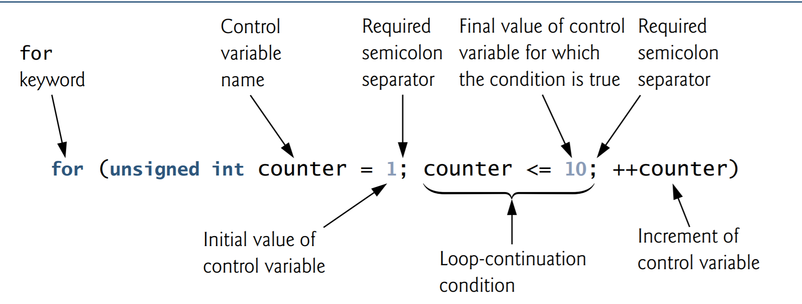
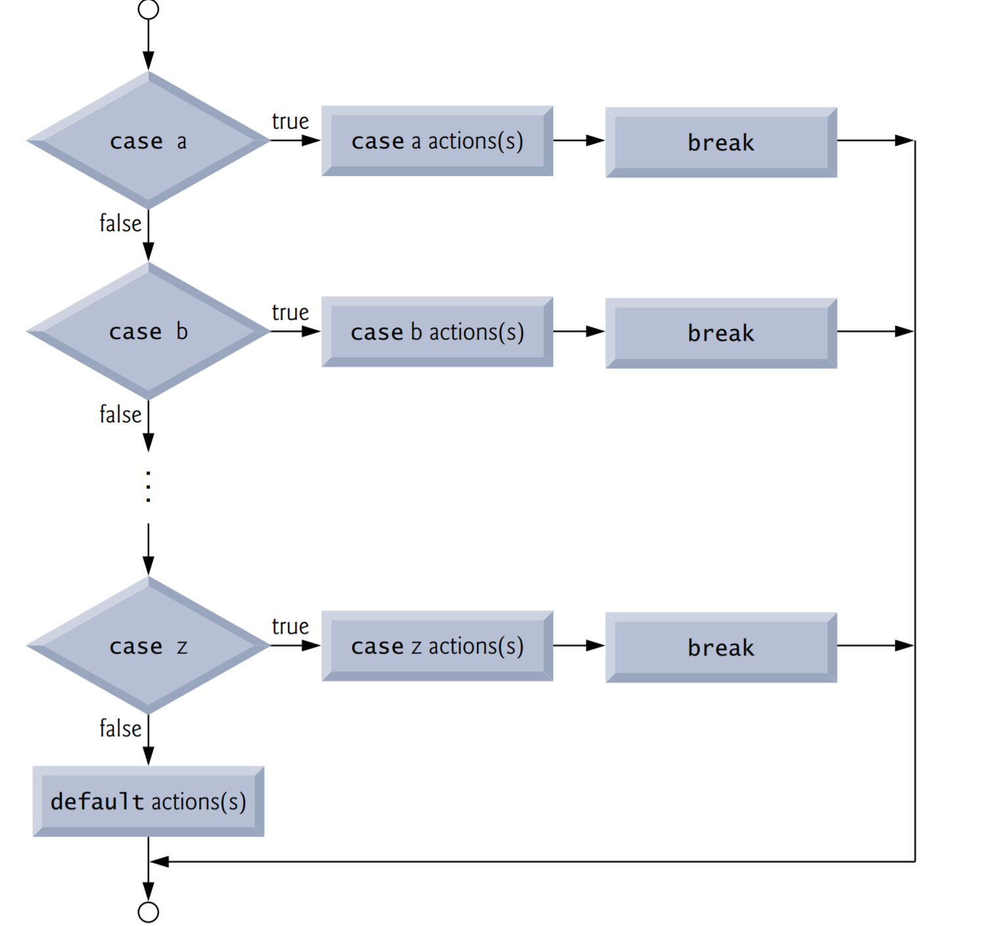
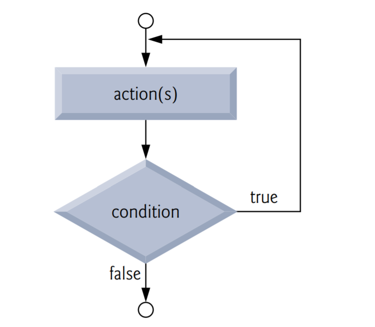
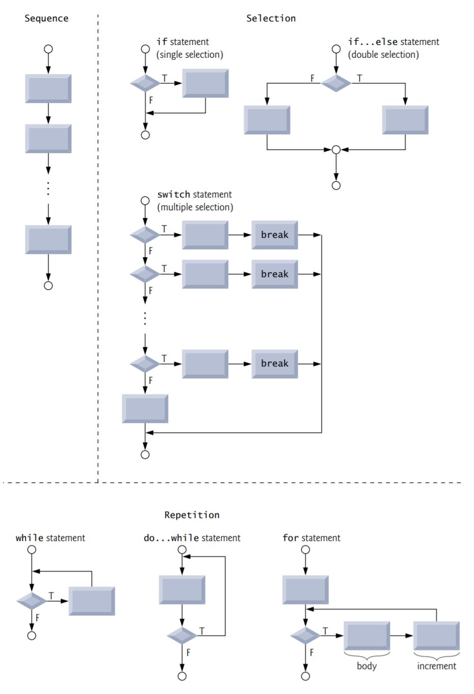

# C Program Control

## Objectives

The essentials of countercontrolled iteration. 

To use the for and do…while iteration statements to execute statements repeatedly.

To understand multiple selection using the switch selection statement. 

To use the break and continue statements to alter the flow of control. 

To use the logical operators to form complex conditional expressions in control statements. 

To avoid the consequences of confusing the equality and assignment operators.

## Introduction

You should now be comfortable with writing simple, complete C programs. In this chapter, iteration is considered in greater detail, and additional iteration control statements, namely the for and the do…while, are presented. The switch multiple-selection statement is introduced. We discuss the break statement for exiting immediately from certain control statements, and the continue statement for skipping the remainder of the body of an iteration statement, then proceeding with the next iteration of the loop. 

## Iteration Essentials

Most programs involve iteration, or looping. A loop is a group of instructions the computer executes repeatedly while some loop-continuation condition remains true. We’ve discussed two means of iteration:

1. Counter-controlled iteration
2. Sentinel-controlled iteration

Counter-controlled iteration is sometimes called definite iteration because we know in advance exactly how many times the loop will be executed. Sentinel-controlled iteration is sometimes called indefinite iteration because it’s not known in advance how many times the loop will be executed.

In counter-controlled iteration, a control variable is used to count the number of iterations. The control variable is incremented (usually by 1) each time the group of instructions is performed. When the value of the control variable indicates that the correct number of iterations has been performed, the loop terminates and execution continues with the statement after the iteration statement

Sentinel values are used to control iteration when:

1. The precise number of iterations isn’t known in advance, and
2. The loop includes statements that obtain data each time the loop is performed.

The sentinel value indicates “end of data.” The sentinel is entered after all regular data items have been supplied to the program. Sentinels must be distinct from regular data items.

## Counter-Controlled Iteration

Counter-controlled iteration requires:

1. The name of a control variable (or loop counter).
2. The initial value of the control variable.
3. The increment (or decrement) by which the control variable is modified each time through the loop.
4. The condition that tests for the final value of the control variable (i.e., whether looping should continue).

```c
#include <stdio.h>

int main(void) {
    unsigned int counter = 1; // initialization
    
    while (counter <= 10) { // iteration condition
        printf("%u\n", counter);
        ++counter; // increment
    }
}
```

The definition and initialization of counter also could have been written as

```c
unsigned int counter;
counter = 1;
```

The definition is not executable, but the assignment is. We’ll use both methods of setting the values of variables. 

The statement

```c
++counter; // increment
```

increments the loop counter by 1 each time the loop is performed. The loop-continuation condition in the while statement tests whether the value of the control variable is less than or equal to 10 (the last value for which the condition is true). The body of this while is performed even when the control variable is 10. The loop terminates when the control variable exceeds 10 (i.e., counter becomes 11).

You could make the program more concise by initializing counter to 0 and by replacing the while statement with

```c
while (++counter <= 10) {
    printf("%u\n", counter);
}
```

This code saves a statement because the incrementing is done directly in the while condition before the condition is tested. Coding in such a condensed fashion takes some practice. Some programmers feel that this makes the code too cryptic and error prone. 

## for Iteration Statement

The for iteration statement handles all the details of counter-controlled iteration. 

```c
#include <stdio.h>

int main(void) {
    // initialization, iteration condition, and increment 
    // are all included in the for statement header.
    for (unsigned int counter = 1; counter <= 10; ++counter) {
        printf("%u\n", counter);
    }
}
```

### for Statement Header Components

Notice that the for statement “does it all”—it specifies each of the items needed for counter-controlled iteration with a control variable. If there’s more than one statement in the body of the for, braces are required to define the body of the loop, you should always place a control statement’s body in braces, even if it has only one statement. 



### Control Variables Defined in a for Header Exist Only Until the Loop Terminates

When you define the control variable in the for header before the first semicolon (;)

```c
for (unsigned int counter = 1; counter <= 10; ++counter) {
```

the control variable exists only until the loop terminates. 

### Off-By-One Errors

If you incorrectly wrote counter < 10, then the loop would be executed only 9 times. This is a common logic error called an off-by-one error.

### General Format of a for Statement

The general format of the for statement is 

```c
for (initialization; condition; increment) {
	statement
}
```

where the initialization expression initializes the loop-control variable, the condition expression is the loop-continuation condition and the increment expression increments the control variable.

### Comma-Separated Lists of Expressions

Often, the initialization expression and the increment expression are comma-separated lists of expressions. The commas as used here are actually comma operators which guarantee that lists of expressions evaluate from left to right. The value and type of a comma-separated list of expressions are the value and type of the rightmost expression in the list. The comma operator is most often used in the for statement. Its primary use is to enable you to use multiple initialization and/or multiple increment expressions. For example, there may be two control variables in a single for statement that must be initialized and incremented. 

### Expressions in the for Statement’s Header Are Optional

The three expressions in the for statement are optional. If the condition expression is omitted, C assumes that the loop-continuation condition is true, thus creating an infinite loop. You may omit the initialization expression if the control variable is initialized before the for statement. The increment expression may be omitted if the increment is calculated by statements in the for statement’s body or if no increment is needed. 

### Increment Expression Acts Like a Standalone Statement

## for Statement: Notes and Observations


##  Examples Using the for Statement

### Application: Compound-Interest Calculations

### A Caution about Using Type float or double for Monetary Amounts

### Formatting Numeric Output

## switch Multiple-Selection Statement

Occasionally, an algorithm will contain a series of decisions in which a variable or expression is tested separately for each of the constant integral values it may assume, and different actions are taken. This is called multiple selection. C provides the switch multiple-selection statement to handle such decision making. 

The switch statement consists of a series of case labels, an optional default case and statements to execute for each case.

### Reading Character Input

In the program, the user enters letter grades for a class. In the while header

```c
while ((grade = getchar()) != EOF)
```

the parenthesized assignment (grade = getchar()) executes first. The getchar function (from ) reads one character from the keyboard and stores that character in the integer variable grade. Characters are normally stored in variables of type char. However, an important feature of C is that characters can be stored in any integer data type because they’re usually represented as one-byte integers in the computer. Function getchar returns as an int the character that the user entered. We can treat a character as either an integer or a character, depending on its use. For example, the statement 

```c
printf("The character (%c) has the value %d.\n", 'a', 'a');
```

uses the conversion specifiers %c and %d to print the character 'a' and its integer value, respectively. The result is

```
The character (a) has the value 97.
```

### ASCII

The integer 97 is the character’s numerical representation in the computer. Many computers today use the ASCII (American Standard Code for Information Interchange) character set in which 97 represents the lowercase letter 'a'. Characters can be read with scanf by using the conversion specifier %c. 

### Assignments Have Values

Assignments as a whole actually have a value. This value is assigned to the variable on the left side of the =. The value of the assignment expression grade = getchar() is the character that’s returned by getchar and assigned to the variable grade. 

The fact that assignments have values can be useful for setting several variables to the same value. For example, 

```c
a = b = c = 0;
```

first evaluates the assignment c = 0 (because the = operator associates from right to left). The variable b is then assigned the value of the assignment c = 0 (which is 0). Then, the variable a is assigned the value of the assignment b = (c = 0) (which is also 0). In the program, the value of the assignment grade = getchar() is compared with the value of EOF (a symbol whose acronym stands for “end of file”). We use EOF (which normally has the value -1) as the sentinel value. The user types a system-dependent keystroke combination to mean “end of file”—i.e., “I have no more data to enter.” EOF is a symbolic integer constant defined in the  header (we’ll see in Chapter 6 how symbolic constants are defined). If the value assigned to grade is equal to EOF, the program terminates. We’ve chosen to represent characters in this program as ints because EOF has an integer value (again, normally -1). 

### Entering the EOF Indicator

On Linux/UNIX/Mac OS X systems, the EOF indicator is entered by typing 

```
ctrl + d
```

on a line by itself. This notation  ctrl + d means to simultaneously press both the Ctrl key and the d key. On other systems, such as Microsoft Windows, the EOF indicator can be entered by typing 

```
ctrl + z
```

You also need to press Enter on Windows.

The user enters grades at the keyboard. When the Enter key is pressed, the characters are read by function getchar one at a time. If the character entered is not equal to EOF, the switch statement is entered. 

### switch Statement Details

Keyword switch is followed by the variable name grade in parentheses. This is called the controlling expression. The value of this expression is compared with each of the case labels. Assume the user has entered the letter C as a grade. C is automatically compared to each case in the switch. If a match occurs (case 'C':), the statements for that case are executed. In the case of the letter C, cCount is incremented by 1, and the switch statement is exited immediately with the break statement. 

The break statement causes program control to continue with the first statement after the switch statement. The break statement is used because the cases in a switch statement would otherwise run together. If break is not used anywhere in a switch statement, then each time a match occurs in the statement, the statements for all the remaining cases will be executed. (This feature—called fall-through—is rarely useful) If no match occurs, the default case is executed, and an error message is printed. 

### switch Statement Flowchart

Each case can have one or more actions. The switch statement is different from all other control statements in that braces are not required around multiple actions in a case of a switch. The flowchart makes it clear that each break statement at the end of a case causes control to immediately exit the switch statement.



### Ignoring Newline, Tab and Blank Characters in Input

To have the program read the characters, you must send them to the computer by pressing Enter. This causes the newline character to be placed in the input after the character we wish to process. Often, this newline must be specifically ignored to make the program work correctly. The preceding cases in our switch statement prevent the error message in the default case from being printed each time a newline, tab or space is encountered in the input. So each input causes two iterations of the loop—the first for the letter grade and the second for '\n'. Listing several case labels together simply means that the same set of actions is to occur for each of the cases.

### Constant Integral Expressions

When using the switch statement, remember that each individual case can test only a constant integral expression—i.e., any combination of character constants and integer constants that evaluates to a constant integer value. A character constant can be represented as the specific character in single quotes, such as 'A'. Characters must be enclosed within single quotes to be recognized as character constants—characters in double quotes are recognized as strings. Integer constants are simply integer values. In our example, we’ve used character constants. Remember that characters are represented as small integer values. 

### Notes on Integral Types

Portable languages like C must have flexible data-type sizes. Different applications may need integers of different sizes. C provides several data types to represent integers. In addition to int and char, C provides types short int (which can be abbreviated as short) and long int (which can be abbreviated as long), as well as unsigned variations of all the integral types. The C standard specifies the minimum range of values for each integer type, but the actual range may be greater and depends on the implementation. For short ints the minimum range is – 32767 to +32767. For most integer calculations, long ints are sufficient. The minimum range of values for long ints is –2147483647 to +2147483647. The range of values for an int is greater than or equal to that of a short int and less than or equal to that of a long int. On many of today’s platforms, ints and long ints represent the same range of values. The data type signed char can be used to represent integers in the range –127 to +127 or any of the characters in the computer’s character set. 

## do...while Iteration Statement

The do…while iteration statement is similar to the while statement. In the while statement, the loop-continuation condition is tested at the beginning of the loop before the body of the loop is performed. The do…while statement tests the loop-continuation condition after the loop body is performed. Therefore, the loop body will always execute at least once. When a do…while terminates, execution continues with the statement after the while clause. The do…while statement is written as follows:

```c
do {
	statements
} while (condition); // semicolon is required here
```

### do…while Statement Flowchart



## break and continue Statements

### break Statement

The break statement, when executed in a while, for, do…while or switch statement, causes an immediate exit from that statement. Program execution continues with the next statement after that while, for, do…while or switch. Common uses of break are to escape early from a loop or to skip the remainder of a switch.

### continue Statement

The continue statement, when executed in a while, for or do…while statement, skips the remaining statements in that control statement’s body and performs the next iteration of the loop. In while and do…while statements, the loop-continuation test is evaluated immediately after the continue statement executes. In the for statement, the increment expression executes, then the loop-continuation test is evaluated.

## Logical Operators

So far we’ve studied only simple conditions, such as counter <= 10, total > 1000, and number != sentinelValue. We’ve expressed these conditions in terms of the relational operators, >, <, >= and <=, and the equality operators, == and !=. Each decision tested precisely one condition. To test multiple conditions in the process of making a decision, we had to perform these tests in separate statements or in nested if or if…else statements. C provides logical operators that may be used to form more complex conditions by combining simple conditions. The logical operators are && (logical AND), || (logical OR) and ! (logical NOT, also called logical negation). We’ll consider examples of each of these operators.

### Logical AND (&&) Operator

Suppose we wish to ensure that two conditions are both true before we choose a certain path of execution. In this case, we can use the logical operator && as follows:

```c
if (gender == 1 && age >= 65) {
	++seniorFemales;
}
```

This if statement contains two simple conditions. The condition gender == 1 might be evaluated, for example, to determine whether a person is a female. The condition age >= 65 is evaluated to determine whether a person is a senior citizen. The two simple conditions are evaluated first because == and >= each have higher precedence than &&. The if statement then considers the combined condition gender == 1 && age >= 65, which is true if and only if both of the simple conditions are true. Finally, if this combined condition is true, then the count of seniorFemales is incremented by 1. If either or both of the simple conditions are false, then the program skips the incrementing and proceeds to the statement following the if. 

| expression1 | expression2 | expression1 && expression2 |
| ----------- | ----------- | -------------------------- |
| 0           | 0           | 0                          |
| 0           | nonzero     | 0                          |
| nonzero     | 0           | 0                          |
| nonzero     | nonzero     | 1                          |

The table shows all four possible combinations of zero (false) and nonzero (true) values for expression1 and expression2. Such tables are often called truth tables. C evaluates all expressions that include relational operators, equality operators, and/or logical operators to 0 or 1. Although C sets a true value to 1, it accepts any nonzero value as true. 

### Logical OR (||) Operator

Now let’s consider the || (logical OR) operator. Suppose we wish to ensure at some point in a program that either or both of two conditions are true before we choose a certain path of execution. In this case, we use the || operator, as in the following program segment:

```c
if (semesterAverage >= 90 || finalExam >= 90) {
	puts("Student grade is A");
}
```

This statement also contains two simple conditions. The condition semesterAverage >= 90 is evaluated to determine whether the student deserves an “A” in the course because of a solid performance throughout the semester. The condition finalExam >= 90 is evaluated to determine whether the student deserves an “A” in the course because of an outstanding performance on the final exam. The if statement then considers the combined condition

```c
semesterAverage >= 90 || finalExam >= 90
```

and awards the student an “A” if either or both of the simple conditions are true. The message “Student grade is A” is not printed only when both of the simple conditions are false (zero). 

| expression1 | expression2 | expression1 \|\| expression2 |
| ----------- | ----------- | ---------------------------- |
| 0           | 0           | 0                            |
| 0           | nonzero     | 1                            |
| nonzero     | 0           | 1                            |
| nonzero     | nonzero     | 1                            |

### Short-Circuit Evaluation

The && operator has a higher precedence than ||. Both operators associate from left to right. An expression containing && or || operators is evaluated only until truth or falsehood is known. Thus, evaluation of the condition 

```c
gender == 1 && age >= 65
```

will stop if gender is not equal to 1 (i.e., the entire expression is guaranteed to be false), and continue if gender is equal to 1 (i.e., the entire expression could still be true if age >= 65). This performance feature for the evaluation of logical AND and logical OR expressions is called short-circuit evaluation. 

### Logical Negation (!) Operator

C provides the ! (logical negation) operator to enable you to “reverse” the meaning of a condition. Unlike operators && and ||, which combine two conditions (and are therefore binary operators), the logical negation operator has only a single condition as an operand (and is therefore a unary operator). The logical negation operator is placed before a condition when we’re interested in choosing a path of execution if the original condition (without the logical negation operator) is false, such as in the following program segment:

```c
if (!(grade == sentinelValue)) {
	printf("The next grade is %f\n", grade);
}
```

The parentheses around the condition grade == sentinelValue are needed because the logical negation operator has a higher precedence than the equality operator.

| expression | !expression |
| ---------- | ----------- |
| 0          | 1           |
| nonzero    | 0           |

In most cases, you can avoid using logical negation by expressing the condition differently with an appropriate relational operator. For example, the preceding statement may also be written as:

```c
if (grade != sentinelValue) {
	printf("The next grade is %f\n", grade);
}
```

### Summary of Operator Precedence and Associativity

### The _Bool Data Type

The C standard includes a boolean type—represented by the keyword _Bool—which can hold only the values 0 or 1. Recall C’s convention of using zero and nonzero values to represent false and true—the value 0 in a condition evaluates to false, while any nonzero value evaluates to true. Assigning any nonzero value to a _Bool sets it to 1. The standard also includes the  header, which defines bool as a shorthand for the type _Bool, and true and false as named representations of 1 and 0, respectively. At preprocessor time, bool, true and false are replaced with _Bool, 1 and 0. 

## Confusing Equality (==) and Assignment (=) Operators

There’s one type of error that C programmers, no matter how experienced, tend to make so frequently that we feel it is worth a separate section. That error is accidentally swapping the operators == (equality) and = (assignment). What makes these swaps so damaging is the fact that they do not ordinarily cause compilation errors. Rather, statements with these errors ordinarily compile correctly, allowing programs to run to completion while likely generating incorrect results through runtime logic errors.

Two aspects of C cause these problems. One is that any expression that produces a value can be used in the decision portion of any control statement. If the value is 0, it’s treated as false, and if the value is nonzero, it’s treated as true. The second is that assignments in C produce a value, namely the value that’s assigned to the variable on the left side of the assignment operator. 

For example, suppose we intend to write

```c
if (payCode == 4) {
	printf("%s", "You get a bonus!");
}
```

but we accidentally write

```c
if (payCode = 4) {
	printf("%s", "You get a bonus!");
}
```

The first if statement properly awards a bonus to the person whose paycode is equal to 4. The second if statement—the one with the error—evaluates the assignment expression in the if condition. This expression is a simple assignment whose value is the constant 4. Because any nonzero value is interpreted as “true,” the condition in this if statement is always true, and not only is the value of payCode inadvertently set to 4, but the person always receives a bonus regardless of what the actual paycode is!

### lvalues and rvalues

You’ll probably be inclined to write conditions such as x == 7 with the variable name on the left and the constant on the right. By reversing these terms so that the constant is on the left and the variable name is on the right, as in 7 == x, then if you accidentally replace the == operator with =, you’ll be protected by the compiler. The compiler will treat this as a syntax error, because only a variable name can be placed on the left-hand side of an assignment expression. This will prevent the potential devastation of a runtime logic error. 

Variable names are said to be lvalues (for “left values”) because they can be used on the left side of an assignment operator. Constants are said to be rvalues (for “right values”) because they can be used only on the right side of an assignment operator. lvalues can also be used as rvalues, but not vice versa.

### Confusing == and = in Standalone Statements

The other side of the coin can be equally unpleasant. Suppose you want to assign a value to a variable with a simple statement such as 

```c
x = 1;
```

but instead write

```c
x == 1;
```

Here, too, this is not a syntax error. Rather the compiler simply evaluates the conditional expression. If x is equal to 1, the condition is true and the expression returns the value 1. If x is not equal to 1, the condition is false and the expression returns the value 0. Regardless of what value is returned, there’s no assignment operator, so the value is simply lost, and the value of x remains unaltered, probably causing an execution-time logic error. Unfortunately, we do not have a handy trick available to help you with this problem! Many compilers, however, will issue a warning on such a statement.

##  Structured Programming Summary

Just as architects design buildings by employing the collective wisdom of their profession, so should programmers design programs. Our field is younger than architecture is, and our collective wisdom is considerably sparser. We’ve learned a great deal in a mere eight decades. Perhaps most important, we’ve learned that structured programming produces programs that are easier (than unstructured programs) to understand and therefore are easier to test, debug, modify, and even prove correct in a mathematical sense. 



## Secure C Programming

### Checking Function scanf’s Return Value

### Range Checking

