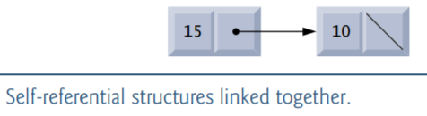
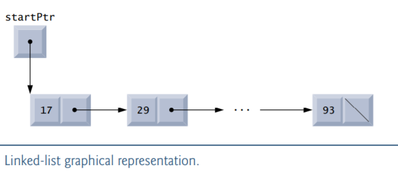
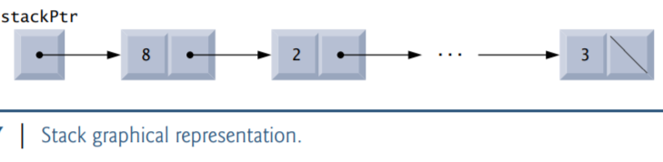
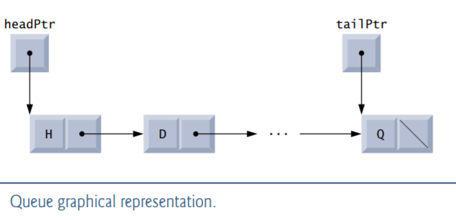
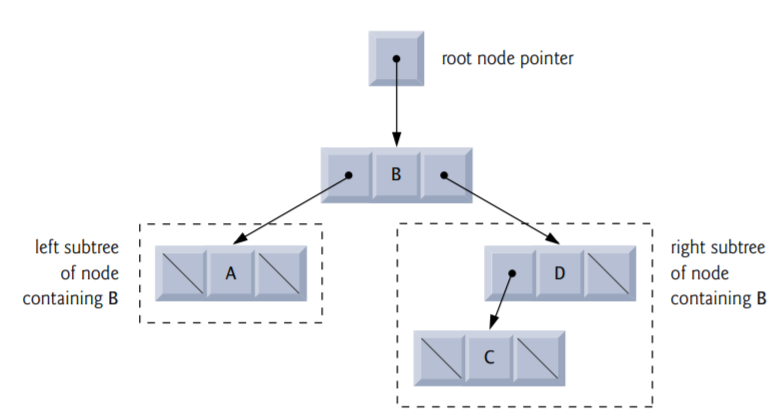

# C Data Structures

## Objectives

Allocate and free memory dynamically for data objects. 

Form linked data structures using pointers, self-referential structures and recursion. 

Create and manipulate linked lists, queues, stacks and binary trees.

Learn important applications of linked data structures. 

Study Secure C programming recommendations for pointers and dynamic memory allocation. 

Optionally build your own compiler in the exercises.

## Introduction

We’ve studied fixed-size data structures such as one-dimensional arrays, two-dimensional arrays and structs. This chapter introduces dynamic data structures that can grow and shrink at execution time. 

***Linked lists*** are collections of data items “lined up in a row”—insertions and deletions are made *anywhere* in a linked list. 

***Stacks*** are important in compilers and operating systems—insertions and deletions are made *only at one end of a stack*—its top. 

***Queues*** represent waiting lines; insertions are made *only at the back* (also referred to as the tail) of a queue and deletions are made *only from the front* (also referred to as the head) of a queue.

***Binary trees*** facilitate high-speed searching and sorting of data, efficiently eliminating duplicate data items and compiling expressions into machine language.

## Self-Referential Structure

A self-referential structure contains a pointer member that points to a structure of the same structure type.

```c
struct node {
    int data;
    struct node *nextPtr;
};
```

defines a type, struct node. A structure of type struct node has two members—integer member data and pointer member nextPtr. Member nextPtr points to a structure of type struct node—a structure of the same type as the one being declared here, hence the term self-referential structure. Member nextPtr is referred to as a link—i.e., it can be used to “tie” (i.e., link) a structure of type struct node to another structure of the same type. Self-referential structures can be linked together to form useful data structures such as lists, queues, stacks and trees. Figure below illustrates two self-referential structure objects linked together to form a list. A slash—representing a NULL pointer—is placed in the link member of the second self-referential structure to indicate that the link does not point to another structure. [Note: The slash is only for illustration purposes; it does not correspond to the backslash character in C.] A NULL pointer normally indicates the end of a data structure just as the null character indicates the end of a string.



## Dynamic Memory Allocation

Creating and maintaining dynamic data structures that can grow and shrink as the program runs requires dynamic memory allocation—the ability for a program to obtain more memory space at execution time to hold new nodes, and to release space no longer needed. 

Functions malloc and free, and operator sizeof, are essential to dynamic memory allocation. Function malloc takes as an argument the number of bytes to be allocated and returns a pointer of type void * (pointer to void) to the allocated memory. As you recall, a void * pointer may be assigned to a variable of any pointer type. Function malloc is normally used with the sizeof operator. For example, the statement

```c
newPtr = malloc(sizeof(struct node));
```

evaluates sizeof(struct node) to determine a struct node object’s size in bytes, allocates a new area in memory of that number of bytes and stores a pointer to the allocated memory in newPtr. The memory is not guaranteed to be initialized, though many implementations initialize it for security. If no memory is available, malloc returns NULL. 

Function free deallocates memory—i.e., the memory is returned to the system so that it can be reallocated in the future. To free memory dynamically allocated by the preceding malloc call, use the statement

```c
free(newPtr);
```

C also provides functions calloc and realloc for creating and modifying dynamic arrays.

## Linked Lists

A linked list is a linear collection of self-referential structures, called nodes, connected by pointer links—hence, the term “linked” list. A linked list is accessed via a pointer to the first node of the list. Subsequent nodes are accessed via the link pointer member stored in each node. By convention, the link pointer in the last node of a list is set to NULL to mark the end of the list. Data is stored in a linked list dynamically—each node is created as necessary. A node can contain data of any type including other structs. Stacks and queues are also linear data structures, and, as we’ll see, are constrained versions of linked lists. Trees are nonlinear data structures.

Lists of data can be stored in arrays, but linked lists provide several advantages. A linked list is appropriate when the number of data elements to be represented in the data structure is unpredictable. Linked lists are dynamic, so the length of a list can increase or decrease at execution time as necessary. The size of an array created at compile time, however, cannot be altered. Arrays can become full. Linked lists become full only when the system has insufficient memory to satisfy dynamic storage allocation requests.

Linked lists can be maintained in sorted order by inserting each new element at the proper point in the list. 

Linked-list nodes are normally not stored contiguously in memory. Logically, however, the nodes of a linked list appear to be contiguous. 



### Function insert


### Function delete


### Function printList


## Stacks

A stack can be implemented as a constrained version of a linked list. New nodes can be added to a stack and removed from a stack only at the top. For this reason, a stack is referred to as a last-in, first-out (LIFO) data structure. A stack is referenced via a pointer to the top element of the stack. The link member in the last node of the stack is set to NULL to indicate the bottom of the stack. 

We represent stacks and linked lists in these figures identically. The difference between stacks and linked lists is that insertions and deletions may occur anywhere in a linked list, but only at the top of a stack.



### Primary Stack Operations

The primary functions used to manipulate a stack are push and pop. Function push creates a new node and places it on top of the stack. Function pop removes a node from the top of the stack, frees the memory that was allocated to the popped node and returns the popped value. 

### Implementing a Stack


### Function push


### Function pop


### Applications of Stacks


## Queues

Another common data structure is the queue. A queue is similar to a checkout line in a grocery store—the first person in line is serviced first, and other customers enter the line only at the end and wait to be serviced. Queue nodes are removed only from the head of the queue and are inserted only at the tail of the queue. For this reason, a queue is referred to as a first-in, first-out (FIFO) data structure. The insert and remove operations are known as enqueue (pronounced “en-cue”) and dequeue (pronounced “dee-cue”), respectively. 

Queues have many applications in computer systems. For computers that have only a single processor, only one user at a time may be serviced. Entries for the other users are placed in a queue. Each entry gradually advances to the front of the queue as users receive service. The entry at the front of the queue is the next to receive service. Similarly, for today’s multicore systems, there could be more users than there are processors, so the users not currently running are placed in a queue until a currently busy processor becomes available. In Appendix, we discuss multithreading. When a user’s work is divided into multiple threads capable of executing in parallel, there could be more threads than there are processors, so the threads not currently running need to be waiting in a queue. 

Queues are also used to support print spooling. A multiuser environment may have only a single printer. Many users may be generating outputs to be printed. If the printer is busy, other outputs may still be generated. These are spooled (just as sewing thread is wrapped around a spool until it’s needed) to disk where they wait in a queue until the printer becomes available.

Information packets also wait in queues in computer networks. Each time a packet arrives at a network node, it must be routed to the next node on the network along the path to its final destination. The routing node routes one packet at a time, so additional packets are enqueued until the router can route them. 



### Function enqueue


### Function dequeue


## Trees

Linked lists, stacks and queues are linear data structures. A tree is a nonlinear, two-dimensional data structure with special properties. Tree nodes contain two or more links. This section discusses binary trees —trees whose nodes all contain two links (none, one, or both of which may be NULL). The root node is the first node in a tree. Each link in the root node refers to a child. The left child is the first node in the left subtree, and the right child is the first node in the right subtree. The children of a node are called siblings. A node with no children is called a leaf node. Computer scientists normally draw trees with the root node at the top—exactly the opposite of trees in nature.



In this section, a special binary tree called a binary search tree is created. A binary search tree (with no duplicate node values) has the characteristic that the values in any left subtree are less than the value in its parent node, and the values in any right subtree are greater than the value in its parent node. The shape of the binary search tree that corresponds to a set of data can vary, depending on the order in which the values are inserted into the tree.

### Function insertNode


### Traversals: Functions inOrder, preOrder and postOrder


### Duplicate Elimination


### Binary Tree Search


### Other Binary Tree Operations


## Secure C Programming

MEM01-C/MEM30-C: Pointers should not be left uninitialized. Rather, they should be assigned either NULL or the address of a valid item in memory. When you use free to deallocate dynamically allocated memory, the pointer passed to free is not assigned a new value, so it still points to the memory location where the dynamically allocated memory used to be. Using such a “dangling” pointer can lead to program crashes and security vulnerabilities. When you free dynamically allocated memory, you should immediately assign the pointer either NULL or a valid address. We chose not to do this for local pointer variables that immediately go out of scope after a call to free. 

MEM01-C: Undefined behavior occurs when you attempt to use free to deallocate dynamic memory that was already deallocated—this is known as a “double free vulnerability.” To ensure that you don’t attempt to deallocate the same memory more than once, immediately set a pointer to NULL after the call to free—attempting to free a NULL pointer has no effect. 

ERR33-C: Most standard library functions return values that enable you to determine whether the functions performed their tasks correctly. Function malloc, for example, returns NULL if it’s unable to allocate the requested memory. You should always ensure that malloc did not return NULL before attempting to use the pointer that stores malloc’s return value. 

