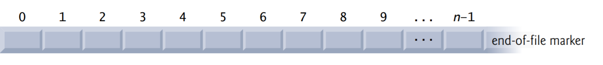
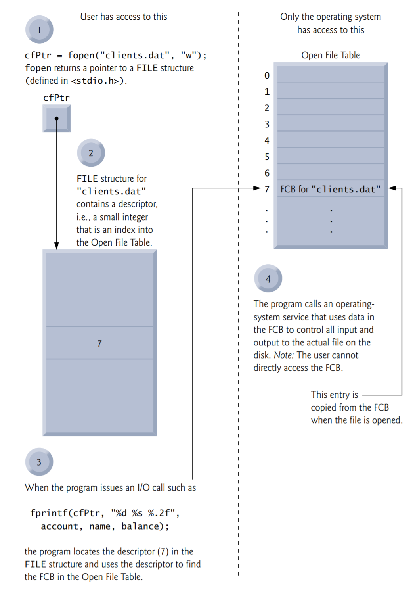
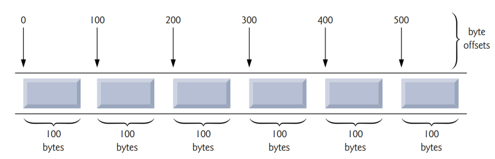
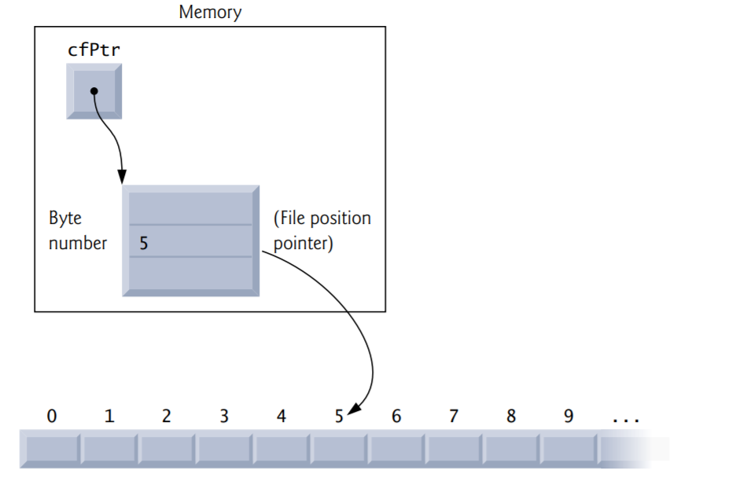

# C File Processing

## Objectives

Understand the concepts of files and streams. 

Create and read data using sequential-access file processing. 

Create, read and update data using random-access file processing. 

Develop a substantial transaction-processing program. 

Study Secure C programming in the context of file processing.

## Introduction

Storage of data in variables and arrays is temporary—such data is lost when a program terminates. Files are used for long-term retention of data. Computers store files on secondary storage devices, such as hard drives, solid-state drives, flash drives and DVDs. In this chapter, we explain how data files are created, updated and processed by C programs. We consider both sequential-access and random-access file processing. 

## Files and Streams

C views each file simply as a sequential stream of bytes. Each file ends either with an end-of-file marker or at a specific byte number recorded in a system-maintained, administrative data structure—this is determined by each platform and is hidden from you. 



### Standard Streams in Every Program 

When a file is opened, a stream is associated with it. Three streams are automatically opened when program execution begins:

- the standard input (which receives input from the keyboard), 
- the standard output (which displays output on the screen) and 
-  the standard error (which displays error messages on the screen) . 

### Communication Channels

Streams provide communication channels between files and programs. For example, the standard input stream enables a program to read data from the keyboard, and the standard output stream enables a program to print data on the screen. 

### FILE Structure

Opening a file returns a pointer to a FILE structure (defined in ) that contains information used to process the file. In some operating systems, this structure includes a file descriptor, i.e., an integer index into an operating-system array called the open file table. Each array element contains a file control block (FCB)—information that the operating system uses to administer a particular file. The standard input, standard output and standard error are manipulated using stdin, stdout and stderr.

### File-Processing Function fgetc

The standard library provides many functions for reading data from files and for writing data to files. Function fgetc, like getchar, reads one character from a file. Function fgetc receives as an argument a FILE pointer for the file from which a character will be read. The call fgetc(stdin) reads one character from stdin—the standard input. This call is equivalent to the call getchar(). 

### File-Processing Function fputc

Function fputc, like putchar, writes one character to a file. Function fputc receives as arguments a character to be written and a pointer for the file to which the character will be written. The function call fputc('a', stdout) writes the character 'a' to stdout— the standard output. This call is equivalent to putchar('a'). 

### Other File-Processing Functions

Several other functions used to read data from standard input and write data to standard output have similarly named file-processing functions. The fgets and fputs functions, for example, can be used to read a line from a file and write a line to a file, respectively. In the next several sections, we introduce the file-processing equivalents of functions scanf and printf—fscanf and fprintf. Later in the chapter we discuss functions fread and fwrite.

## Creating a Sequential-Access File

C imposes no structure on a file. Thus, notions such as a record of a file are not part of the C language. 

### Pointer to a FILE

### Using fopen to Open the File

### Using feof to Check for the End-of-File Indicator

### Using fprintf to Write to the File

### Using fclose to Close the File

#### Relationship Betweeen FILE Pointers, FILE Structures and FCBs



### File Open Modes

| Mode | Description                                                  |
| ---- | ------------------------------------------------------------ |
| r    | Open an existing file for reading.                           |
| w    | Create a file for writing. If the file already exists, discard the current contents. |
| a    | Open or create a file for writing at the end of the file—i.e., write operations append data to the file. |
| r+   | Open an existing file for update (reading and writing).      |
| w+   | Create a file for reading and writing. If the file already exists, discard the current contents. |
| a+   | Open or create a file for reading and updating; all writing is done at the end of the file—i.e., write operations append data to the file. |
| rb   | Open an existing file for reading in binary mode.            |
| wb   | Create a file for writing in binary mode. If the file already exists, discard the current contents. |
| ab   | Append: open or create a file for writing at the end of the file in binary mode. |
| rb+  | Open an existing file for update (reading and writing) in binary mode. |
| wb+  | Create a file for update in binary mode. If the file already exists, discard the current contents. |
| ab+  | Append: open or create a file for update in binary mode; writing is done at the end of the file. |

#### C11 Exclusive Write Mode

In addition, C11 provides exclusive write mode, which you indicate by adding an x to the end of the w, w+, wb or wb+ modes. In exclusive write mode, fopen will fail if the file already exists or cannot be created. If opening a file in exclusive write mode is successful and the underlying system supports exclusive file access, then only your program can access the file while it’s open. (Some compilers and platforms do not support exclusive write mode.) If an error occurs while opening a file in any mode, fopen returns NULL. 

## Reading Data from a Sequential-Access File

Data is stored in files so that it can be retrieved for processing when needed.

### Resetting the File Position Pointer

### Credit Inquiry Program

#### Updating a Sequential File

## Random-Access Files

As we stated previously, records in a file created with the formatted output function fprintf are not necessarily of the same length. However, individual records that you write to and read from a random-access file are normally fixed in length and may be accessed directly (and thus quickly) without searching through other records. This makes randomaccess files appropriate for airline reservation systems, banking systems, point-of-sale systems, and other kinds of transaction-processing systems that require rapid access to specific data. There are other ways of implementing random-access files, but we’ll limit our discussion to this straightforward approach using fixed-length records.

Because every record in a random-access file normally has the same length, the exact location of a record relative to the beginning of the file can be calculated as a function of the record key. We’ll soon see how this facilitates immediate access to specific records, even in large files. 



Fixed-length records enable data to be inserted in a random-access file without destroying other data in the file. Data stored previously can also be updated or deleted without rewriting the entire file. In the following sections we explain how to 

- create a random-access file, 
- enter data, 
- read the data both sequentially and randomly, 
- update the data, 
- and delete data no longer needed. 

## Creating a Random-Access File

Function fwrite transfers a specified number of bytes beginning at a specified location in memory to a file. The data is written beginning at the location in the file indicated by the file position pointer. Function fread transfers a specified number of bytes from the location in the file specified by the file position pointer to an area in memory beginning with a specified address. Now, when writing a four-byte integer, instead of using

```c
fprintf(fPtr, "%d", number);
```

which could print a single digit or as many as 11 digits (10 digits plus a sign, each of which requires at least one byte of storage, based on the character set for the locale), we can use

```c
fwrite(&number, sizeof(int), 1, fPtr);
```

which always writes four bytes on a system with four-byte integers from a variable number to the file represented by fPtr (we’ll explain the 1 argument shortly). Later, fread can be used to read those four bytes into an integer variable number. Although fread and fwrite read and write data, such as integers, in fixed-size rather than variable-size format, the data they handle are processed in computer “raw data” format (i.e., bytes of data) rather than in printf’s and scanf’s human-readable text format. Because the “raw” representation of data is system dependent, “raw data” may not be readable on other systems, or by programs produced by other compilers or with other compiler options.

### fwrite and fread Can Write and Read Arrays

Functions fwrite and fread are capable of reading and writing arrays of data to and from files. The third argument of both fread and fwrite is the number of elements in the array that should be read from or written to a file. The preceding fwrite function call writes a single integer to a file, so the third argument is 1 (as if one element of an array were being written). File-processing programs rarely write a single field to a file. Normally, they write one struct at a time, as we show in the following examples. 

## Writing Data Randomly to a Random-Access File

### Positioning the File Position Pointer with fseek

#### fseek Function Prototype

The function prototype for fseek is 

```c
int fseek(FILE *stream, long int offset, int whence);
```

where offset is the number of bytes to seek from whence in the file pointed to by stream— a positive offset seeks forward and a negative one seeks backward. Argument whence is one of the values SEEK_SET, SEEK_CUR or SEEK_END (all defined in ), which indicate the location from which the seek begins. SEEK_SET indicates that the seek starts at the beginning of the file; SEEK_CUR indicates that the seek starts at the current location in the file; and SEEK_END indicates that the seek is measured from at the end of the file. 



### Error Checking

For simplicity, the programs in this chapter do not perform error checking. Industrial-strength programs should determine whether functions such as fscanf, fseek and fwrite operate correctly by checking their return values. Function fscanf returns the number of data items successfully read or the value EOF if a problem occurs while reading data. Function fseek returns a nonzero value if the seek operation cannot be performed (e.g., attempting to seek to a position before the start of the file). Function fwrite returns the number of items it successfully output. If this number is less than the third argument in the function call, then a write error occurred.

## Reading Data from a Random-Access File

Function fread reads a specified number of bytes from a file into memory. For example,

```c
fread(&client, sizeof(struct clientData), 1, cfPtr);
```

reads the number of bytes determined by sizeof(struct clientData) from the file referenced by cfPtr, stores the data in client and returns the number of bytes read. The bytes are read from the location specified by the file position pointer. Function fread can read several fixed-size array elements by providing a pointer to the array in which the elements will be stored and by indicating the number of elements to be read. The preceding statement reads one element. To read more than one, specify the number of elements as fread’s third argument. Function fread returns the number of items it successfully input. If this number is less than the third argument in the function call, then a read error occurred. 

## Case Study: Transaction-Processing Program

## Secure C Programming

### fprintf_s and fscanf_s

The new standard’s Annex K provides more secure versions of these functions named fprintf_s and fscanf_s that are identical to the printf_s and scanf_s functions we’ve previously introduced, except that you also specify a FILE pointer argument indicating the file to manipulate. If your C compiler’s standard libraries include these functions, you should use them instead of fprintf and fscanf. As with scanf_s and printf_s, Microsoft’s versions of fprintf_s and fscanf_s differ from those in Annex K.

### CERT Secure C Coding Standard

FIO03-C: When opening a file for writing using the nonexclusive file-open modes, if the file exists, function fopen opens it and truncates its contents, providing no indication of whether the file existed before the fopen call. To ensure that an existing file is not opened and truncated, you can use C11’s new exclusive write mode, which allows fopen to open the file only if it does not already exist.

FIO04-C: In industrial-strength code, you should always check the return values of file-processing functions that return error indicators to ensure that the functions performed their tasks correctly.

FIO07-C. Function rewind does not return a value, so you cannot test whether the operation was successful. It’s recommended instead that you use function fseek, because it returns a nonzero value if it fails.

FIO09-C. We demonstrated both text files and binary files in this chapter. Due to differences in binary data representations across platforms, files written in binary format often are not portable. For more portable file representations, consider using text files or a function library that can handle the differences in binary file representations across platforms. 

FIO14-C. Some library functions do not operate identically on text files and binary files. In particular, function fseek is not guaranteed to work correctly with binary files if you seek from SEEK_END, so SEEK_SET should be used.

FIO42-C. On many platforms, you can have only a limited number of files open at once. For this reason, you should always close a file as soon as it’s no longer needed by your program.

