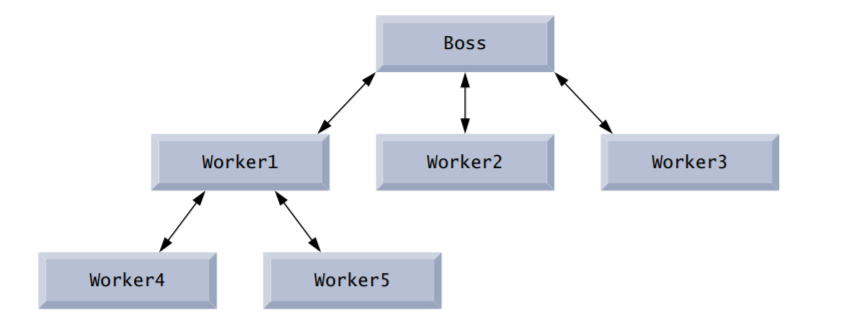

# C Functions

## Objectives

Construct programs modularly from small pieces called functions.

Use common math functions in the C standard library. 

Create new functions. 

Use the mechanisms that pass information between functions. 

Learn how the function call/ return mechanism is supported by the function call stack and stack frames. 

Use simulation techniques based on random number generation. 

Write and use functions that call themselves.

## Introduction

Most computer programs that solve real-world problems are much larger than the programs presented in the first few chapters. Experience has shown that the best way to develop and maintain a large program is to construct it from smaller pieces, each of which is more manageable than the original program. This technique is called divide and conquer. This chapter describes some key features of the C language that facilitate the design, implementation, operation and maintenance of large programs.

##  Modularizing Programs in C

In C, functions are used to modularize programs. Programs are typically written by combining new functions you write with prepackaged functions available in the C standard library. We discuss both kinds of functions in this chapter. The C standard library provides a rich collection of functions for performing common mathematical calculations, string manipulations, character manipulations, input/output, and many other useful operations. This makes your job easier, because these functions provide many of the capabilities you need.

The C language and the standard library are both specified by the C standard, and they’re both provided with standard C systems (with the exception that some of the libraries are designated as optional). The functions printf, scanf and pow that we’ve used in previous chapters are standard library functions.

You can write functions to define specific tasks that may be used at many points in a program. These are sometimes referred to as programmer-defined functions. The actual statements defining the function are written only once, and the statements are hidden from other functions. 

Functions are invoked by a function call, which specifies the function name and provides information (as arguments) that the function needs to perform its designated task. A common analogy for this is the hierarchical form of management. A boss (the calling function or caller) asks a worker (the called function) to perform a task and report back when the task is done. For example, a function needing to display information on the screen calls the worker function printf to perform that task, then printf displays the information and reports back—or returns—to the calling function when its task is completed. The boss function does not know how the worker function performs its designated tasks. The worker may call other worker functions, and the boss will be unaware of this. We’ll soon see how this “hiding” of implementation details promotes good software engineering. 



## Math Library Functions


## Functions

Functions allow you to modularize a program. All variables defined in function definitions are local variables—they can be accessed only in the function in which they’re defined. Most functions have a list of parameters that provide the means for communicating information between functions via arguments in function calls. A function’s parameters are also local variables of that function. 

There are several motivations for “functionalizing” a program. The divide-and-conquer approach makes program development more manageable. Another motivation is software reusability—using existing functions as building blocks to create new programs. Software reusability is a major factor in the object-oriented programming movement that you’ll learn more about when you study languages derived from C, such as C++, Objective-C, Java, C# (pronounced “C sharp”) and Swift. With good function naming and definition, programs can be created from standardized functions that accomplish specific tasks, rather than being built by using customized code. This is known as abstraction. We use abstraction each time we use standard library functions like printf, scanf and pow. A third motivation is to avoid repeating code in a program. Packaging code as a function allows it to be executed from other locations in a program simply by calling the function. 

## Function Definitions

Each program we’ve presented has consisted of a function called main that called standard library functions to accomplish its tasks. We now consider how to write custom functions.

```c
#include <stdio.h>

int square(int y);

int main(void) {
    for (int x = 1; x <= 10; ++x) {
        printf("%d ", square(x));
    }
    
    puts("");
}

int square(int y) {
    return y * y;
}
```

### Calling Function

Function square is invoked or called in main within the printf statement

```c
printf("%d ", square(x));
```

Function square receives a copy of the argument x’s value in the parameter y. Then square calculates y * y and passes the result back to main where square was invoked. It continues by passing the square result to function printf, which displays the result on the screen. This process repeats 10 times—once for each iteration of the for statement. 

### Function Definition

The definition of function square shows that square expects an integer parameter y. The keyword int preceding the function name indicates that square returns an integer result. The return statement in square passes the value of the expression y * y (that is, the result of the calculation) back to the calling function. 

### Function Prototype

```c
int square(int y);
```

is a function prototype (also called a function declaration). The int in parentheses informs the compiler that square expects to receive an integer value from the caller. The int to the left of the function name square informs the compiler that square returns an integer result to the caller. The compiler compares the calls to square to the function prototype to ensure that:

- the number of arguments is correct

- the arguments are of the correct type

- the argument types are in the correct order

- the return type is consistent with the context in which the function is called

### Format of a Function Definition

The format of a function definition is

```c
return-value-type function-name(parameter-list)
{
	statements
}
```

The function-name is any valid identifier. The return-value-type is the data type of the result returned to the caller. The return-value-type void indicates that a function does not return a value. Together, the return-value-type, function-name and parameter-list are sometimes referred to as the function header. 

The parameter-list is a comma-separated list that specifies the parameters received by the function when it’s called. If a function does not receive any values, parameter-list is void. A type must be listed explicitly for each parameter. 

### Function Body

The statements within braces form the function body, which is also a block. Variables can be declared in any block, and blocks can be nested (but functions cannot be nested). 

### Returning Control from a Function

There are three ways to return control from a called function to the point at which a function was invoked. If the function does not return a result, control is returned simply when the function-ending right brace is reached, or by executing the statement

```c
return;
```

If the function does return a result, the statement 

```c
return expression;
```

returns the value of expression to the caller. 

### main's Return Type

Notice that main has an int return type. The return value of main is used to indicate whether the program executed correctly. In earlier versions of C, we’d explicitly place

```c
return 0;
```

at the end of main—0 indicates that a program ran successfully. The C standard indicates that main implicitly returns 0 if you to omit the preceding statement—as we’ve done throughout this book. You can explicitly return non-zero values from main to indicate that

a problem occurred during your program’s execution. For information on how to report a program failure, see the documentation for your particular operating-system environment.

## Function Prototypes: A Deeper Look

An important C feature is the function prototype, which was borrowed from C++. The compiler uses function prototypes to validate function calls. Pre-standard C did not perform this kind of checking, so it was possible to call functions improperly without the compiler detecting the errors. Such calls could result in fatal execution-time errors or nonfatal errors that caused subtle, difficult-to-detect problems. Function prototypes correct this deficiency.

### Compilation Errors

A function call that does not match the function prototype is a compilation error.

### Argument Coercion and “Usual Arithmetic Conversion Rules”

Another important feature of function prototypes is the coercion of arguments, i.e., the forcing of arguments to the appropriate type. For example, the math library function sqrt can be called with an integer argument even though the function prototype in  specifies a double parameter, and the function will still work correctly. The statement

```c
printf("%.3f\n", sqrt(4));
```

correctly evaluates sqrt(4) and prints the 2.000. The function prototype causes the compiler to convert a copy of the int value 4 to the double value 4.0 before the copy is passed to sqrt. In general, argument values that do not correspond precisely to the parameter types in the function prototype are converted to the proper type before the function is called. These conversions can lead to incorrect results if C’s usual arithmetic conversion rules are not followed. These specify how values can be converted to other types without losing data. In our sqrt example, an int is automatically converted to a double without changing its value (because double can represent a much larger range of values than int). However, a double converted to an int truncates the double’s fractional part, thus changing the original value. Converting large integer types to small integer types (e.g., long to short) can also result in changed values. 

The usual arithmetic conversion rules automatically apply to expressions containing values of two data types (also referred to as mixed-type expressions), and are handled by the compiler. In a mixed-type expression, the compiler makes a temporary copy of the value that needs to be converted, then converts the copy to the “highest” type in the expression—this is known as promotion. The usual arithmetic conversion rules for a mixed-type expression containing at least one floating-point value are:

- If one of the values is a long double, the other is converted to a long double
-  If one of the values is a double, the other is converted to a double
- If one of the values is a float, the other is converted to a float

If the mixed-type expression contains only integer types, then the usual arithmetic conversions specify a set of integer promotion rules. 

A value can be converted to a lower type only by explicitly assigning the value to a variable of lower type or by using a cast operator. Arguments in a function call are converted to the parameter types specified in a function prototype as if the arguments were being assigned directly to variables of those types. 

If there’s no function prototype for a function, the compiler forms its own function prototype using the first occurrence of the function—either the function definition or a call to the function. This typically leads to warnings or errors, depending on the compiler. 

##  Function Call Stack and Stack Frames

To understand how C performs function calls, we first need to consider a data structure (i.e., collection of related data items) known as a stack. Think of a stack as analogous to a pile of dishes. When a dish is placed on the pile, it’s normally placed at the top (referred to as pushing the dish onto the stack). Similarly, when a dish is removed from the pile, it’s normally removed from the top (referred to as popping the dish off the stack). Stacks are known as last-in, first-out (LIFO) data structures—the last item pushed (inserted) on the stack is the first item popped (removed) from the stack.

An important mechanism for computer science students to understand is the function call stack (sometimes referred to as the program execution stack). This data structure— working “behind the scenes”—supports the function call/return mechanism. It also supports the creation, maintenance and destruction of each called function’s local variables (also called automatic variables). 

As each function is called, it may call other functions, which may call other functions—all before any function returns. Each function eventually must return control to the function that called it. So, we must keep track of the return addresses that each function needs to return control to the function that called it. The function call stack is the perfect data structure for handling this information. Each time a function calls another function, an entry is pushed onto the stack. This entry, called a stack frame, contains the return address that the called function needs in order to return to the calling function. It also contains some additional information we’ll soon discuss. If the called function returns, instead of calling another function before returning, the stack frame for the function call is popped, and control transfers to the return address in the popped stack frame.

Each called function always finds the information it needs to return to its caller at the top of the call stack. And, if a function makes a call to another function, a stack frame for the new function call is simply pushed onto the call stack. Thus, the return address required by the newly called function to return to its caller is now located at the top of the stack.

The stack frames have another important responsibility. Most functions have local (automatic) variables—parameters and some or all of their local variables. Automatic variables need to exist while a function is executing. They need to remain active if the function makes calls to other functions. But when a called function returns to its caller, the called function’s automatic variables need to “go away.” The called function’s stack frame is a perfect place to reserve the memory for automatic variables. That stack frame exists only as long as the called function is active. When that function returns—and no longer needs its local automatic variables—its stack frame is popped from the stack, and those local automatic variables are no longer known to the program.

Of course, the amount of memory in a computer is finite, so only a certain amount of memory can be used to store stack frames on the function call stack. If more function calls occur than can have their stack frames stored on the function call stack, a fatal error known as stack overflow occurs.

### Function Call Stack in Action

## Headers

Each standard library has a corresponding header containing the function prototypes for all the functions in that library and definitions of various data types and constants needed by those functions. 

##  Passing Arguments By Value and By Reference

In many programming languages, there are two ways to pass arguments—pass-by-value and pass-by-reference. When arguments are passed by value, a copy of the argument’s value is made and passed to the called function. Changes to the copy do not affect an original variable’s value in the caller. When an argument is passed by reference, the caller allows the called function to modify the original variable’s value. 

Pass-by-value should be used whenever the called function does not need to modify the value of the caller’s original variable. This prevents the accidental side effects (variable modifications) that so greatly hinder the development of correct and reliable software systems. Pass-by-reference should be used only with trusted called functions that need to modify the original variable.

##  Random Number Generation

## Example: A Game of Chance; Introducing enum

### Enumerations

##  Storage Classes

C provides the storage class specifiers auto, register, 1 extern and static. 2 An identifier’s storage class determines its storage duration, scope and linkage. An identifier’s storage duration is the period during which the identifier exists in memory. Some exist briefly, some are repeatedly created and destroyed, and others exist for the program’s entire execution. An identifier’s scope is where the identifier can be referenced in a program. Some can be referenced throughout a program, others from only portions of a program. An identifier’s linkage determines for a multiple-source-file program whether the identifier is known only in the current source file or in any source file with proper declarations. This section discusses storage classes and storage duration. 

The storage-class specifiers can be split between automatic storage duration and static storage duration. Keyword auto is used to declare variables of automatic storage duration. Variables with automatic storage duration are created when program control enters the block in which they’re defined; they exist while the block is active, and they’re destroyed when program control exits the block. 

### Local Variables

Only variables can have automatic storage duration. A function’s local variables (those declared in the parameter list or function body) normally have automatic storage duration. Keyword auto explicitly declares variables of automatic storage duration. Local variables have automatic storage duration by default, so keyword auto is rarely used. For the remainder of the text, we’ll refer to variables with automatic storage duration simply as automatic variables.

### Static Storage Class

Keywords extern and static are used in the declarations of identifiers for variables and functions of static storage duration. Identifiers of static storage duration exist from the time at which the program begins execution until the program terminates. For static variables, storage is allocated and initialized only once, before the program begins execution. For functions, the name of the function exists when the program begins execution. However, even though the variables and the function names exist from the start of program execution, this does not mean that these identifiers can be accessed throughout the program. Storage duration and scope (where a name can be used) are separate issues.

There are several types of identifiers with static storage duration: external identifiers (such as global variables and function names) and local variables declared with the storageclass specifier static. Global variables and function names are of storage class extern by default. Global variables are created by placing variable declarations outside any function definition, and they retain their values throughout the execution of the program. Global variables and functions can be referenced by any function that follows their declarations or definitions in the file. This is one reason for using function prototypes—when we include stdio.h in a program that calls printf, the function prototype is placed at the start of our file to make the name printf known to the rest of the file.

Local variables declared with the keyword static are still known only in the function in which they’re defined, but unlike automatic variables, static local variables retain their value when the function is exited. The next time the function is called, the static local variable contains the value it had when the function last exited. The following statement declares local variable count to be static and initializes it to 1. 

```c
static int count = 1;
```

All numeric variables of static storage duration are initialized to zero by default if you do not explicitly initialize them. 

##  Scope Rules

The scope of an identifier is the portion of the program in which the identifier can be referenced. For example, when we define a local variable in a block, it can be referenced only following its definition in that block or in blocks nested within that block. The four identifier scopes are function scope, file scope, block scope, and function-prototype scope.

Labels (identifiers followed by a colon such as start:) are the only identifiers with function scope. Labels can be used anywhere in the function in which they appear, but cannot be referenced outside the function body. Labels are used in switch statements (as case labels) and in goto statements. Labels are hidden in the function in which they’re defined. This hiding—more formally called information hiding—is a means of implementing the principle of least privilege—a fundamental principle of good software engineering. In the context of an application, the principle states that code should be granted only the amount of privilege and access that it needs to accomplish its designated task, but no more. 

An identifier declared outside any function has file scope. Such an identifier is “known” (i.e., accessible) in all functions from the point at which the identifier is declared until the end of the file. Global variables, function definitions, and function prototypes placed outside a function all have file scope. 

Identifiers defined inside a block have block scope. Block scope ends at the terminating right brace (}) of the block. Local variables defined at the beginning of a function have block scope, as do function parameters, which are considered local variables by the function. Any block may contain variable definitions. When blocks are nested, and an identifier in an outer block has the same name as an identifier in an inner block, the identifier in the outer block is hidden until the inner block terminates. This means that while executing in the inner block, the inner block sees the value of its own local identifier and not the value of the identically named identifier in the enclosing block. Local variables declared static still have block scope, even though they exist from before program startup. Thus, storage duration does not affect the scope of an identifier.

The only identifiers with function-prototype scope are those used in the parameter list of a function prototype. As mentioned previously, function prototypes do not require names in the parameter list—only types are required. If a name is used in the parameter list of a function prototype, the compiler ignores the name. Identifiers used in a function prototype can be reused elsewhere in the program without ambiguity.

## Recursion

For some types of problems, it’s useful to have functions call themselves. A recursive function is one that calls itself either directly or indirectly through another function. Recursion is a complex topic discussed at length in upper-level computer science courses. In this section and the next, we present simple examples of recursion.

We consider recursion conceptually first, then examine several programs containing recursive functions. Recursive problem-solving approaches have a number of elements in common. A recursive function is called to solve a problem. The function actually knows how to solve only the simplest case(s), or so-called base case(s). If the function is called with a base case, the function simply returns a result. If the function is called with a more complex problem, the function typically divides the problem into two conceptual pieces: a piece that the function knows how to do and a piece that it does not know how to do. To make recursion feasible, the latter piece must resemble the original problem, but be a slightly simpler or smaller version. Because this new problem looks like the original problem, the function launches (calls) a fresh copy of itself to work on the smaller problem—this is referred to as a recursive call or the recursion step. The recursion step also includes a return statement, because its result will be combined with the portion of the problem the function knew how to solve to form a result that will be passed back to the original caller.

The recursion step executes while the original call to the function is paused, waiting for the result from the recursion step. The recursion step can result in many more such recursive calls, as the function keeps dividing each problem with which it’s called into two conceptual pieces. For the recursion to terminate, each time the function calls itself with a slightly simpler version of the original problem, this sequence of smaller problems must eventually converge on the base case. When the function recognizes the base case, it returns a result to the previous copy of the function, and a sequence of returns ensues all the way up the line until the original call of the function eventually returns the final result to its caller. As an example of these concepts at work, let’s write a recursive program to perform a popular mathematical calculation. 

### Recursively Calculating Factorials

## Example Using Recursion: Fibonacci Series

### Order of Evaluation of Operands

C specifies the order of evaluation of the operands of only four operators—&&, ||, the comma (,) operator and ?:. The first three of these are binary operators whose operands are guaranteed to be evaluated left to right. [Note: The commas used to separate the arguments in a function call are not comma operators.] The last operator is C’s only ternary operator. Its leftmost operand is always evaluated first; if the leftmost operand evaluates to nonzero (true), the middle operand is evaluated next and the last operand is ignored; if the leftmost operand evaluates to zero (false), the third operand is evaluated next and the middle operand is ignored.

### Exponential Complexity

## Recursion vs. Iteration

In the previous sections, we studied two functions that can easily be implemented either recursively or iteratively. In this section, we compare the two approaches and discuss why you might choose one approach over the other in a particular situation. 

- Both iteration and recursion are based on a control statement: Iteration uses an iteration statement; recursion uses a selection statement
- Both iteration and recursion involve repetition: Iteration uses an iteration statement; recursion achieves repetition through repeated function calls
- Iteration and recursion each involve a termination test: Iteration terminates when the loop-continuation condition fails; recursion when a base case is recognized
- Iteration with counter-controlled iteration and recursion each gradually approach termination: Iteration keeps modifying a counter until the counter assumes a value that makes the loop-continuation condition fail; recursion keeps producing simpler versions of the original problem until the base case is reached
- Both iteration and recursion can occur infinitely: An infinite loop occurs with iteration if the loop-continuation test never becomes false; infinite recursion occurs if the recursion step does not reduce the problem each time in a manner that converges on the base case. Infinite iteration and recursion typically occur as a result of errors in a program’s logic

Recursion has many negatives. It repeatedly invokes the mechanism, and consequently the overhead, of function calls. This can be expensive in both processor time and memory space. Each recursive call causes another copy of the function (actually only the function’s variables) to be created; this can consume considerable memory. Iteration normally occurs within a function, so the overhead of repeated function calls and extra memory assignment is omitted. So why choose recursion?

Let’s close this chapter with some observations that we make repeatedly throughout the book. Good software engineering is important. High performance is important. Unfortunately, these goals are often at odds with one another. Good software engineering is key to making more manageable the task of developing the larger and more complex software systems we need. High performance is key to realizing the systems of the future that will place ever greater computing demands on hardware. Where do functions fit in here? 

##  Secure C Programming

### Secure Random Numbers

