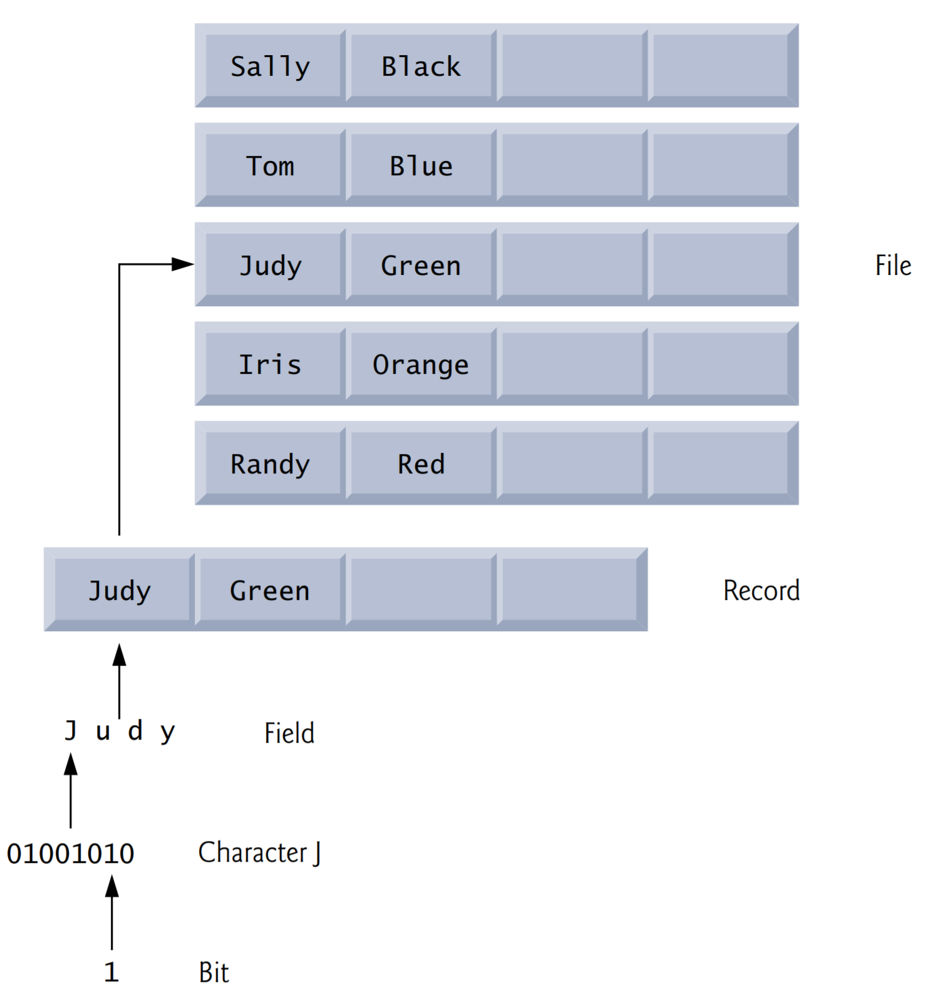
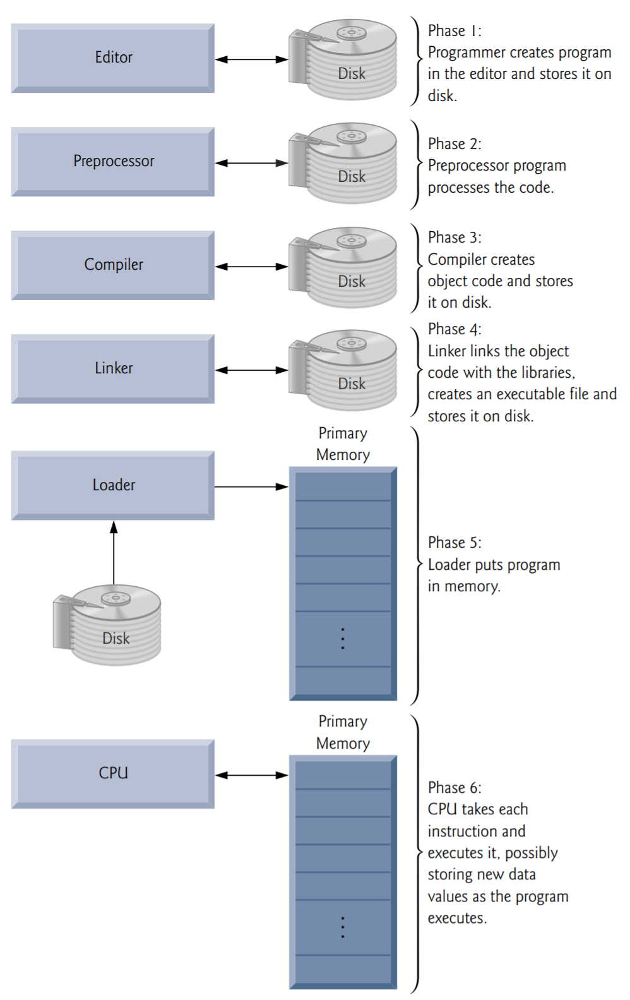

# General Introduction to Computer Science  

## Be comfortable being uncomfortable

- You will encounter a lot of questions. You should be confused sometimes. Struggle and fully embrace the confusion.
- Blaming won't help.
- If you can't solve a problem, there's an easier problem you can't solve. Find it and solve it. It's your responsibility.
- Do understand the fundamentals.

## TIPS

- Prepare for lectures. Syllabus and notes. 30min ~ 1h
- Read assignments immediately. Implanting the idea into your head. Figuring out what you don't know.
- Find a friend and explain things. Explain to each other what have been done.

## Resources

### Textbook

- Read it

### Online Reference

- Use carefully, make sure you digest the knowledge and quote with respect

### Ask me & mate

- [FAQ](../FAQ/FAQ.md)

## Objectives

Basic computer concepts. 

The different types of programming languages. 

The history of the C programming language. 

The purpose of the C Standard Library. 

The basics of object technology. 

A typical C program-development environment. 

To test-drive a C application in Windows, Linux and Mac OS X. 

Some basics of the Internet and the World Wide Web.

## Introduction

The core of the class focuses on  software engineering through the proven methodologies of structured programming in C.

[All example programs](../resource/example.zip)

Most people are familiar with the exciting tasks that computers perform. In this course, you’ll learn how to command computers to perform those tasks. It’s ***software*** (i.e., the instructions you write to command computers to perform actions and make decisions) that controls computers (often referred to as ***hardware***). 

## Hardware and Software

Computers process data under the control of sequences of instructions called computer programs. These software programs guide the computer through ordered actions specified by people called computer programmers. 

A computer consists of various devices referred to as hardware (e.g., the keyboard, screen, mouse, hard disks, memory, DVD drives and processing units).

### Moore's Law

For many decades, hardware costs have fallen rapidly. 

Every year or two, the capacities of computers have approximately doubled inexpensively. 

### Computer Organization

Regardless of differences in physical appearance, computers can be envisioned as divided into various logical units or sections.

| Logical unit                    | Examples                                                     |
| ------------------------------- | ------------------------------------------------------------ |
| Input unit                      | Keyboard, Mouse, Mic.                                        |
| Output unit                     | Display                                                      |
| Memory unit                     | RAM.                                                         |
| Arithmetic and logic unit (ALU) | Inside CPU                                                   |
| Central processing unit (CPU)   | CPU. A multi-core processor implements multiple processors on a single integrated-circuit chip—a dual-core processor has two CPUs and a quadcore processor has four CPUs |
| Secondary storage unit          | USB flash drives                                             |

## Data Hierarchy

Data items processed by computers form a data hierarchy that becomes larger and more complex in structure as we progress from the simplest data items (called “bits”) to richer ones, such as characters and fields. 

### Bits 

Binary digit, 0 or 1.

***1 Byte = 8 bits***

### Characters

A computer’s character set use a combination of bits to represent character.

ASCII (American Standard Code for Information Interchange).

### Fields

A field is a group of characters or bytes that conveys meaning. 

### Records

Several related fields can be used to compose a record. 

### Files

A file is a group of related records. 

| Unit             | Bytes          | Which is approximately                                       |
| ---------------- | -------------- | ------------------------------------------------------------ |
| 8 bits           | 1 byte         |                                                              |
| 1 kilobyte (KB)  | 1024 bytes     | 103 (1024 bytes exactly)                          |
| 1 megabyte (MB)  | 1024 kilobytes | 106 (1,000,000 bytes exactly)                     |
| 1 gigabyte (GB)  | 1024 megabytes | 109 (1,000,000,000 bytes exactly)                 |
| 1 terabyte (TB)  | 1024 gigabytes | 1012 (1,000,000,000,000 bytes exactly)            |
| 1 petabyte (PB)  | 1024 terabytes | 1015 (1,000,000,000,000,000 bytes exactly)        |
| 1 exabyte (EB)   | 1024 petabytes | 1018 (1,000,000,000,000,000,000 bytes exactly)    |
| 1 zettabyte (ZB) | 1024 exabytes  | 1021 (1,000,000,000,000,000,000,000 bytes exactly) |

## Machine Languages, Assembly Languages and High-level Languages

Programmers write instructions in various programming languages, some directly understandable by computers and others requiring intermediate translation steps. Hundreds of such languages are in use today. These may be divided into three general types:

1. Machine languages
2. Assembly languages
3. High-level languages

### Machine Languages

Any computer can directly understand only its own machine language, defined by its hardware design. Machine languages generally consist of strings of numbers (ultimately reduced to 1s and 0s) that instruct computers to perform their most elementary operations one at a time. Machine languages are machine dependent (a particular machine language can be used on only one type of computer). 

Such languages are cumbersome for humans. 

### Assembly Languages and Assemblers

Programming in machine language was simply too slow and tedious for most programmers. Instead of using the strings of numbers that computers could directly understand, programmers began using English-like abbreviations to represent elementary operations. 

Although such code is clearer to humans, it’s incomprehensible to computers until translated to machine language.

### High-Level Languages and Compilers

To speed the programming process, high-level languages were developed in which single statements could be written to accomplish substantial tasks. Translator programs called ***compilers*** convert high-level language programs into machine language. High-level languages allow you to write instructions that look almost like everyday English and contain commonly used mathematical notations.

From the programmer’s standpoint, high-level languages are preferable to machine and assembly languages. C is one of the most widely used high-level programming languages. 

***Interpreters***

Compiling a large high-level language program into machine language can take considerable computer time. Interpreter programs, developed to execute high-level language programs directly, avoid the delay of compilation, although they run slower than compiled programs.

## The C Programming Language

The C language was evolved from B by Dennis Ritchie at Bell Laboratories and was originally implemented in 1972. C initially became widely known as the development language of the UNIX operating system. Many of today’s leading operating systems are written in C and/or C++. C is mostly hardware independent—with careful design, it’s possible to write C programs that are portable to most computers.

***Built for Performance***

C is widely used to develop systems that demand performance

***Standard***

ANSI C -> C99 -> C11

## C standard Library

Avoid “***reinventing the wheel***.” Instead, use existing pieces—this is called software ***reuse***. 

When programming in C you’ll typically use the following building blocks: 

- C Standard Library functions
- Functions you create yourself
- Functions other people (whom you trust) have created and made available to you 

The advantage of creating your own functions is that you’ll know exactly how they work. You’ll be able to examine the C code. The disadvantage is the time-consuming effort that goes into designing, developing, debugging and performance-tuning new functions.

## C++ AND Other C-Based Languages

C++ was developed by Bjarne Stroustrup at Bell Laboratories. It has its roots in C. More important, it provides capabilities for ***object-oriented programming***. ***Objects*** are essentially reusable software ***components*** that model items in the real world. Using a modular, object-oriented designand-implementation approach can make software-development groups more productive.

## Typical C Program-Development Environment

[Setup](../resource/setup.pdf)

C systems generally consist of several parts: a program-development environment, the language and the C Standard Library.

C programs typically go through six phases to be executed. These are: edit, preprocess, compile, link, load and execute.

### Creating a Program

### Preprocessing and Compiling a C Program

### Linking

### Loading

### Execution

### Potential Problems

### Standard Input, Standard Output and Standard Error Streams

## Test-Driving a C Application in Windows, Linux and Mac OS

Run example program.

## Operating Systems

Operating systems are software systems that make using computers more convenient for users, application developers and system administrators. They provide services that allow each application to execute safely, efficiently and concurrently (i.e., in parallel) with other applications. 

The software that contains the core components of the operating system is the ***kernel***. 

### Windows-A Proprietary Operating System

Microsoft developed the Windows operating system, consisting of a graphical user interface built on top of DOS—an enormously popular personal-computer operating system that users interacted with by typing commands.

### Linux-An Open-Source Operating System

The Linux operating system—which is popular in servers, personal computers and embedded systems—is perhaps the greatest success of the ***open-source*** movement. The opensource software development style departs from the proprietary development style (used, for example, with Microsoft’s Windows and Apple’s Mac OS X). With open-source development, individuals and companies—often worldwide—contribute their efforts in developing, maintaining and evolving software. Anyone can use and customize it for their own purposes, typically at no charge. 

### Mac OS; Apple's iOS for iPhone, iPad and iPod Touch Devices

Apple.

### Google's Android

Android—the fastest growing tablet and smartphone operating system—is based on the Linux kernel and Java as its primary programming language. One benefit of developing Android apps is the openness of the platform. The operating system is open source and free. 

## The Internet and World Wide Web

### The Internet: A Network of Networks

### The World Wide Web: Making the Internet User-Friendly

### Web Services

### Ajax

### The internet of Things

## Some Key Software Terminology

## Keeping Up-to-Date With Information Technologies

You can find a growing list of Internet- and web-related Resource Centers at www.deitel.com/ResourceCenters.html

