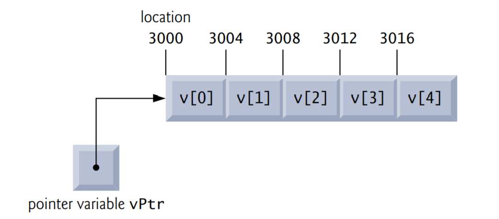

C Pointers

## Objectives

Use pointers and pointer operators. 

Pass arguments to functions by reference using pointers. 

Understand the various placements of the const qualifier and how they affect what you can do with a variable. 

Use the sizeof operator with variables and types. 

Use pointer arithmetic to process the elements in arrays.

Understand the close relationships among pointers, arrays and strings. 

Define and use arrays of strings. 

Use pointers to functions. 

Learn about secure C programming issues with regard to pointers.

## Introduction

In this chapter, we discuss one of the most powerful features of the C programming language, the pointer. Pointers are among C’s most difficult capabilities to master. Pointers enable programs to accomplish pass-by-reference, to pass functions between functions, and to create and manipulate dynamic data structures—ones that can grow and shrink at execution time, such as linked lists, queues, stacks and trees. 

##  Pointer Variable Definitions and Initialization

Pointers are variables whose values are memory addresses. Normally, a variable directly contains a specific value. A pointer, however, contains an address of a variable that contains a specific value. In this sense, a variable name directly references a value, and a pointer indirectly references a value. Referencing a value through a pointer is called indirection. 


### Declaring Pointers

Pointers, like all variables, must be defined before they can be used. The definition 

```c
int *countPtr, count;
```

specifies that variable countPtr is of type int * (i.e., a pointer to an integer) and is read (right to left), “countPtr is a pointer to int” or “countPtr points to an object of type int.” Also, the variable count is defined to be an int, not a pointer to an int. The * applies only to countPtr in the definition. When * is used in this manner in a definition, it indicates that the variable being defined is a pointer. Pointers can be defined to point to objects of any type. To prevent the ambiguity of declaring pointer and non-pointer variables in the same declaration as shown above, you should always declare only one variable per declaration. 

### Initializing and Assigning Values to Pointers

Pointers should be initialized when they’re defined, or they can be assigned a value. A pointer may be initialized to NULL, 0 or an address. A pointer with the value NULL points to nothing. NULL is a symbolic constant defined in the  header (and several other headers, such as ). Initializing a pointer to 0 is equivalent to initializing a pointer to NULL, but NULL is preferred, because it highlights the fact that the variable is of a pointer type. When 0 is assigned, it’s first converted to a pointer of the appropriate type. The value 0 is the only integer value that can be assigned directly to a pointer variable. 

##  Pointer Operators

In this section, we present the address (&) and indirection (*) operators, and the relationship between them.

### The Address (&) Operator

The &, or address operator, is a unary operator that returns the address of its operand. For example, assuming the definitions

```c
int y = 5;
int *yPtr;
```

the statement

```c
yPtr = &y;
```

assigns the address of the variable y to pointer variable yPtr. Variable yPtr is then said to “point to” y. 

### Pointer Representation in Memory


It shows the representation of the preceding pointer in memory, assuming that integer variable y is stored at location 600000, and pointer variable yPtr is stored at location 500000. The operand of the address operator must be a variable; the address operator cannot be applied to constants or expressions.

### The Indirection (*) Operator

The unary * operator, commonly referred to as the indirection operator or dereferencing operator, returns the value of the object to which its operand (i.e., a pointer) points. For example, the statement

```c
printf("%d", *yPtr);
```

prints the value of variable y (5). Using * in this manner is called dereferencing a pointer. 

### Demonstrating the & and * Operators

## Passing Arguments to Functions by Reference

There are two ways to pass arguments to a function—pass-by-value and pass-by-reference. However, all arguments in C are passed by value. Functions often require the capability to modify variables in the caller or receive a pointer to a large data object to avoid the overhead of receiving the object by value (which incurs the time and memory overheads of making a copy of the object). Pass-by-reference also can be used to enable a function to “return” multiple values to its caller by modifying variables in the caller.

### Use & and * to Accomplish Pass-By-Reference

In C, you use pointers and the indirection operator to accomplish pass-by-reference. When calling a function with arguments that should be modified, the addresses of the arguments are passed. This is normally accomplished by applying the address operator (&) to the variable (in the caller) whose value will be modified. As we saw in Chapter 6, arrays are not passed using operator & because C automatically passes the starting location in memory of the array (the name of an array is equivalent to &arrayName[0]). When the address of a variable is passed to a function, the indirection operator (*) may be used in the function to modify the value at that location in the caller’s memory.

### Pass-By-Value

### Pass-By-Reference

### Use a Pointer Parameter to Receive an Address

A function receiving an address as an argument must define a pointer parameter to receive the address.  For example, 

```c
void cubeByReference(int *nPtr)
```

The header specifies that cubeByReference receives the address of an integer variable as an argument, stores the address locally in nPtr and does not return a value.

### Pointer Parameters in Function Prototypes

The function prototype for cubeByReference specifies an int * parameter. As with other variable types, it’s not necessary to include names of pointers in function prototypes. Names included for documentation purposes are ignored by the C compiler.

### Functions That Receive One-Dimensional Arrays

For a function that expects a one-dimensional array as an argument, the function’s prototype and header can use the pointer notation shown in the parameter list of function cubeByReference. The compiler does not differentiate between a function that receives a pointer and one that receives a one-dimensional array. This, of course, means that the function must “know” when it’s receiving an array or simply a single variable for which it’s to perform pass-by-reference. When the compiler encounters a function parameter for a one-dimensional array of the form int b[], the compiler converts the parameter to the pointer notation int *b. The two forms are interchangeable. 

##  Using the const Qualifier with Pointers

The const qualifier enables you to inform the compiler that the value of a particular variable should not be modified. 

Over the years, a large base of legacy code was written in early versions of C that did not use const because it was not available. For this reason, there are significant opportunities for improvement by reengineering old C code. 

Six possibilities exist for using (or not using) const with function parameters—two with pass-by-value parameter passing and four with pass-by-reference parameter passing. How do you choose one of the six possibilities? Let the principle of least privilege be your guide—always award a function enough access to the data in its parameters to accomplish its specified task, but absolutely no more.

### const Values and Parameters

If the copy is modified in the function, the original value in the caller does not change. In many cases, a value passed to a function is modified so the function can accomplish its task. However, in some instances, the value should not be altered in the called function, even though it manipulates only a copy of the original value. 

Consider a function that takes a one-dimensional array and its size as arguments and prints the array. Such a function should loop through the array and output each array element individually. The size of the array is used in the function body to determine when the loop should terminate. Neither the size of the array nor its contents should change in the function body. 

If an attempt is made to modify a value that’s declared const, the compiler catches it and issues either a warning or an error, depending on the particular compiler.

There are four ways to pass a pointer to a function: 

- a non-constant pointer to non-constant data
- a constant pointer to non-constant data
-  a non-constant pointer to constant data
- a constant pointer to constant data

Each of the four combinations provides different access privileges and is discussed in the next several examples.

###  Converting a String to Uppercase Using a Non-Constant Pointer to Non-Constant Data

### Printing a String One Character at a Time Using a Non-Constant Pointer to Constant Data

### Attempting to Modify a Constant Pointer to Non-Constant Data

###  Attempting to Modify a Constant Pointer to Constant Data

##  Bubble Sort Using Pass-by-Reference

## sizeof Operator

C provides the special unary operator sizeof to determine the size in bytes of an array (or any other data type). This operator is applied at compilation time, unless its operand is a variable-length array.

## Pointer Expressions and Pointer Arithmetic

Pointers are valid operands in arithmetic expressions, assignment expressions and comparison expressions. However, not all the operators normally used in these expressions are valid in conjunction with pointer variables. This section describes the operators that can have pointers as operands, and how these operators are used.

### Allowed Operators for Pointer Arithmetic 

A pointer may be incremented (++) or decremented (--), an integer may be added to a pointer (+ or +=), an integer may be subtracted from a pointer (- or -=) and one pointer may be subtracted from another—this last operation is meaningful only when both pointers point to elements of the same array.

### Aiming a Pointer at an Array 

Assume that array int v[5] has been defined and its first element is at location 3000 in memory. Assume pointer vPtr has been initialized to point to v[0]—i.e., the value of vPtr is 3000.



It illustrates this situation for a machine with 4-byte integers. Variable vPtr can be initialized to point to array v with either of the statements

```c
vPtr = v;
vPtr = &v[0];
```

### Adding an Integer to a Pointer

In conventional arithmetic, 3000 + 2 yields the value 3002. This is normally not the case with pointer arithmetic. When an integer is added to or subtracted from a pointer, the pointer is not incremented or decremented simply by that integer, but by that integer times the size of the object to which the pointer refers. The number of bytes depends on the object’s data type. For example, the statement

```c
vPtr += 2;
```

would produce 3008 (3000 + 2 * 4), assuming an integer is stored in 4 bytes of memory. In the array v, vPtr would now point to v[2]. If an integer is stored in 2 bytes of memory, then the preceding calculation would result in memory location 3004 (3000 + 2*2). If the array were of a different data type, the preceding statement would increment the pointer by twice the number of bytes that it takes to store an object of that data type. When performing pointer arithmetic on a character array, the results will be consistent with regular arithmetic, because each character is 1 byte long.


###  Subtracting an Integer from a Pointer 

If vPtr had been incremented to 3016, which points to v[4], the statement

```c
vPtr -= 4;
```

would set vPtr back to 3000—the beginning of the array. 

###  Incrementing and Decrementing a Pointer 

If a pointer is being incremented or decremented by one, the increment (++) and decrement (--) operators can be used. Either of the statements

```c
++vPtr;
vPtr++;
```

increments the pointer to point to the next location in the array. Either of the statements

```c
--vPtr;
vPtr--;
```

decrements the pointer to point to the previous element of the array.

###  Subtracting One Pointer from Another

Pointer variables may be subtracted from one another. For example, if vPtr contains the location 3000, and v2Ptr contains the address 3008, the statement

```c
x = v2Ptr - vPtr;
```

would assign to x the number of array elements from vPtr to v2Ptr, in this case 2 (not 8). Pointer arithmetic is undefined unless performed on an array. We cannot assume that two variables of the same type are stored contiguously in memory unless they’re adjacent elements of an array. 

###  Assigning Pointers to One Another

A pointer can be assigned to another pointer if both have the same type. The exception to this rule is the pointer to void (i.e., void *), which is a generic pointer that can represent any pointer type. All pointer types can be assigned a pointer to void, and a pointer to void can be assigned a pointer of any type (including another pointer to void). In both cases, a cast operation is not required. 

### Pointer to void

A pointer to void cannot be dereferenced. Consider this: The compiler knows that a pointer to int refers to 4 bytes of memory on a machine with 4-byte integers, but a pointer to void simply contains a memory location for an unknown data type—the precise number of bytes to which the pointer refers is not known by the compiler. The compiler must know the data type to determine the number of bytes that represent the referenced value. 

### Comparing Pointers

Pointers can be compared using equality and relational operators, but such comparisons are meaningless unless the pointers point to elements of the same array. Pointer comparisons compare the addresses stored in the pointers. A comparison of two pointers pointing to elements in the same array could show, for example, that one pointer points to a higher-numbered element of the array than the other pointer does. A common use of pointer comparison is determining whether a pointer is NULL. 

##  Relationship between Pointers and Arrays

Arrays and pointers are intimately related in C and often may be used interchangeably. An array name can be thought of as a constant pointer. Pointers can be used to do any operation involving array indexing. 

Assume the following definitions:

```c
int b[5];
int *bPtr;
```

Because the array name b (without an index) is a pointer to the array’s first element, we can set bPtr equal to the address of the array b’s first element with the statement

```c
bPtr = b;
```

This statement is equivalent to taking the address of array b’s first element as follows:

```c
bPtr = &b[0];
```

###  Pointer/Offset Notation

Array element b[3] can alternatively be referenced with the pointer expression

```c
*(bPtr + 3)
```

The 3 in the expression is the offset to the pointer. When bPtr points to the array’s first element, the offset indicates which array element to reference, and the offset value is identical to the array index. This notation is referred to as pointer/offset notation. The parentheses are necessary because the precedence of * is higher than the precedence of +. Without the parentheses, the above expression would add 3 to the value of the expression *bPtr (i.e., 3 would be added to b[0], assuming bPtr points to the beginning of the array). Just as the array element can be referenced with a pointer expression, the address

```c
&b[3]
```

can be written with the pointer expression 

```c
bPtr + 3
```

The array itself can be treated as a pointer and used in pointer arithmetic. For example, the expression

```c
*(b + 3)
```

also refers to the array element b[3]. In general, all indexed array expressions can be written with a pointer and an offset. In this case, pointer/offset notation was used with the name of the array as a pointer. The preceding statement does not modify the array name in any way; b still points to the first element in the array.

### Pointer/Index Notation

Pointers can be indexed like arrays. If bPtr has the value b, the expression

```c
bPtr[1]
```

refers to the array element b[1]. This is referred to as pointer/index notation.

### Cannot Modify an Array Name with Pointer Arithmetic

Remember that an array name always points to the beginning of the array—so the array name is like a constant pointer. Thus, the expression

```c
b += 3
```

is invalid because it attempts to modify the array name’s value with pointer arithmetic.

###  Demonstrating Pointer Indexing and Offsets

### String Copying with Arrays and Pointers

#### Copying with Array Index Notation

#### Copying with Pointers and Pointer Arithmetic

##  Arrays of Pointers

Arrays may contain pointers. A common use of an array of pointers is to form an array of strings, referred to simply as a string array. Each entry in the array is a string, but in C a string is essentially a pointer to its first character. So each entry in an array of strings is actually a pointer to the first character of a string. Consider the definition of string array suit, which might be useful in representing a deck of cards.

```c
const char *suit[4] = {"Hearts", "Diamonds", "Clubs", "Spades"};
```

The suit[4] portion of the definition indicates an array of 4 elements. The char * portion of the declaration indicates that each element of array suit is of type “pointer to char.” Qualifier const indicates that the strings pointed to by each element will not be modified. The four values to be placed in the array are "Hearts", "Diamonds", "Clubs" and "Spades". Each is stored in memory as a null-terminated character string that’s one character longer than the number of characters between the quotes. The four strings are 7, 9, 6 and 7 characters long, respectively. Although it appears these strings are being placed in the suit array, only pointers are actually stored in the array. Each pointer points to the first character of its corresponding string. Thus, even though the suit array is fixed in size, it provides access to character strings of any length. This flexibility is one example of C’s powerful data-structuring capabilities.

The suits could have been placed in a two-dimensional array, in which each row would represent a suit and each column would represent a letter from a suit name. Such a data structure would have to have a fixed number of columns per row, and that number would have to be as large as the largest string. Therefore, considerable memory could be wasted when storing a large number of strings of which most were shorter than the longest string. We use string arrays to represent a deck of cards in the next section.


## Case Study: Card Shuffling and Dealing Simulation

##  Pointers to Functions

A pointer to a function contains the address of the function in memory. A function name is really the starting address in memory of the code that performs the function’s task. Pointers to functions can be passed to functions, returned from functions, stored in arrays and assigned to other function pointers. 

##  Secure C Programming

### printf_s, scanf_s and Other Secure Functions

Earlier Secure C Programming sections presented printf_s and scanf_s, and mentioned other more secure versions of standard library functions that are described by Annex K of the C standard. A key feature of functions like printf_s and scanf_s that makes them more secure is that they have runtime constraints requiring their pointer arguments to be non-NULL. The functions check these runtime constraints before attempting to use the pointers. Any NULL pointer argument is considered to be a constraint violation and causes the function to fail and return a status notification. In a scanf_s, if any of the pointer arguments (including the format-control string) are NULL, the function returns EOF. In a printf_s, if the format-control string or any argument that corresponds to a %s is NULL, the function stops outputting data and returns a negative number. For complete details of the Annex K functions, see the C standard document or your compiler’s library documentation. 

### Other CERT Guidelines Regarding Pointers

